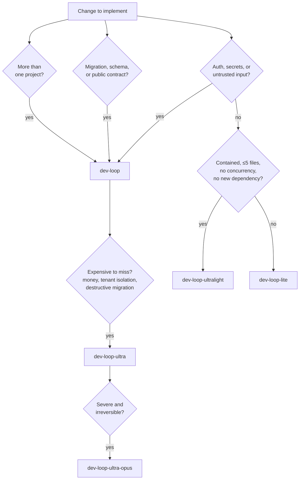
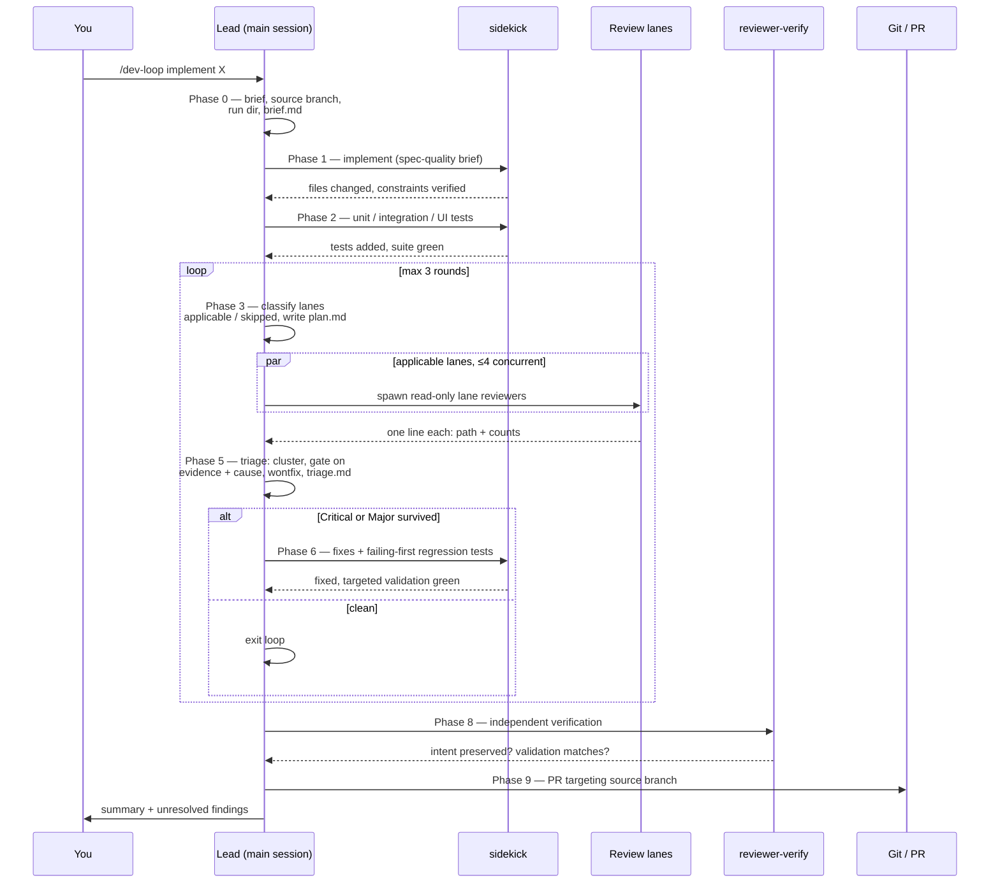
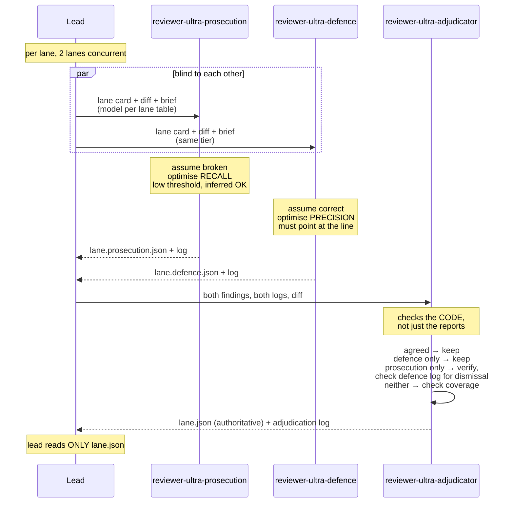
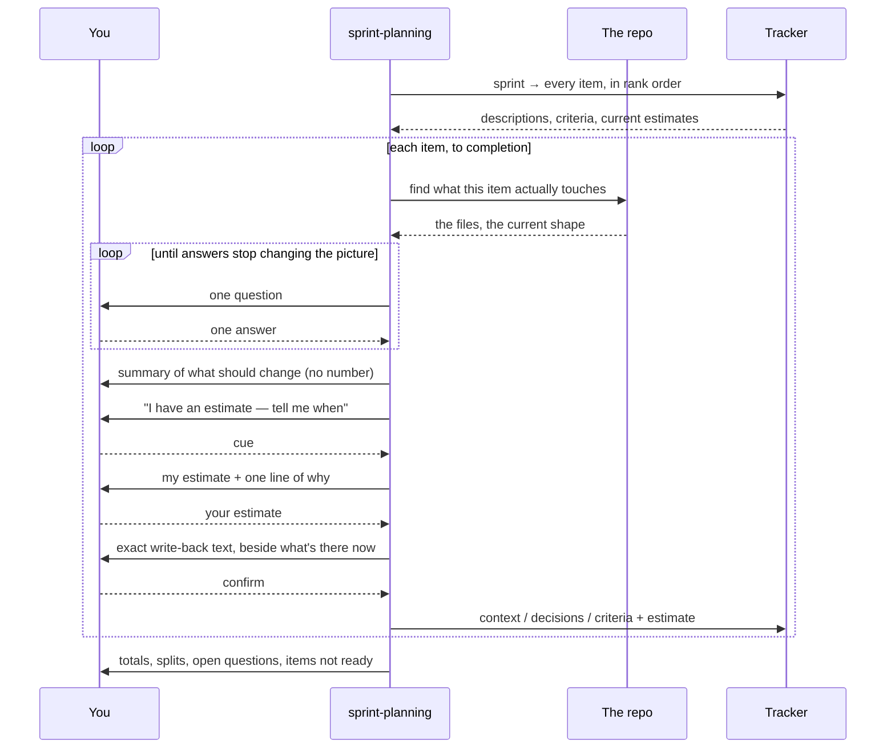
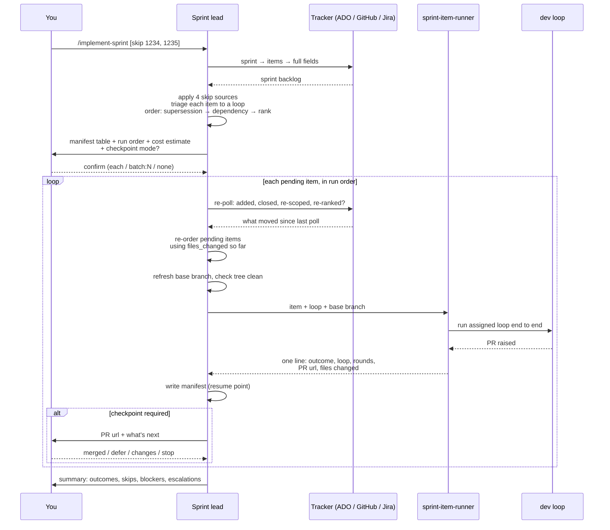

# Claude Code Dev Loops

A set of Claude Code skills and subagents that turn "implement this" into a
bounded, logged, multi-pass review pipeline that ends at a pull request.

Five review loops at different price and depth points, a planner that refines a
sprint's items before any of them are built, an orchestrator that runs them
through the loops one at a time, and a delegation policy that keeps the
orchestrating agent out of the code.

Everything here is plain markdown. There is no runtime and nothing to build —
Claude Code reads these files directly.

---

## Contents

- [The skills](#the-skills)
- [Install](#install)
- [Configure](#configure)
- [Use](#use)
- [Dependencies](#dependencies)
- [Why](#why)
- [The loops](#the-loops)
- [How a loop works](#how-a-loop-works)
- [The adversarial loops](#the-adversarial-loops)
- [Sprint planning](#sprint-planning)
- [Sprint orchestration](#sprint-orchestration)
- [Cost projections](#cost-projections)
- [What to watch](#what-to-watch)
- [Design notes](#design-notes)

---

## The skills

Twelve skills and twenty-three subagents. The loops are what you invoke; the
rest are invoked by them.

### The five dev loops — pick one per change

| Skill | Review shape | Rounds | Cost | Diagram |
| --- | --- | --- | --- | --- |
| `/dev-loop-ultralight` | 1 reviewer, 9-item sweep | 1 | 0.19× | [drawio](docs/diagrams/dev-loop-ultralight.drawio) |
| `/dev-loop-lite` | 4 consolidated lanes | 2 | 0.57× | [drawio](docs/diagrams/dev-loop-lite.drawio) |
| `/dev-loop` | 9 gated lanes | 3 | 1.00× | [drawio](docs/diagrams/dev-loop.drawio) |
| `/dev-loop-ultra` | 9 lanes, each an adversarial triple | 3 | 1.89× | [drawio](docs/diagrams/dev-loop-ultra.drawio) |
| `/dev-loop-ultra-opus` | Same, every reviewer on Opus | 3 | 2.71× | [drawio](docs/diagrams/dev-loop-ultra-opus.drawio) |

All five run the same shape: **frame → implement → tests → plan → parallel
review lanes → triage → fix → loop → verify → walkthrough → PR.** They differ
in review depth and bounds, never in who writes the code. See
[The loops](#the-loops) for which to choose, and `dev-loops.pdf` for all five
as one booklet.

### The two sprint skills

| Skill | What it does | Diagram |
| --- | --- | --- |
| `/sprint-planning` | Grills each item in the sprint, agrees an estimate as planning poker, and writes back context, decisions and acceptance criteria. **The only skill here that writes to the tracker.** | [drawio](docs/diagrams/sprint-planning.drawio) |
| `/implement-sprint` | Triages each item to a loop and runs them one at a time with checkpoints, one PR per item. Reads what `sprint-planning` wrote; never writes back. | [drawio](docs/diagrams/implement-sprint.drawio) |

Run `/sprint-planning` first — it is what turns a sprint of one-line titles into
items `/implement-sprint` can build a brief from.

### The five supporting skills — invoked by the loops, not by you

| Skill | Role |
| --- | --- |
| `coding-standards` | The cross-project style baseline. **A scaffold — replace its rules with yours.** Preloaded into sidekicks and the Standards lane. |
| `solution-architecture` | How to *establish* a repository's architecture before judging anything against it. Repository-agnostic; discovers the facts per repo. |
| `implementation-notes` | Keeps a running `notes.md` of decisions and rejected alternatives while the loop runs. |
| `pr-walkthrough` | Turns those notes into `docs/walkthroughs/<slug>.md` — why the change is shaped this way, not what changed. |
| `pr-walkthrough-review` | Checks that walkthrough and corrects it in place. |

These are rule sets and sub-steps rather than workflows, which is why they have
no diagram.

### The agents

| Group | Agents |
| --- | --- |
| Implementation | `sidekick-lite` (Haiku), `sidekick` (Sonnet, **the default**), `sidekick-heavy` (Opus, xhigh) |
| Recon | `Explore` — pinned to Haiku, shadowing the built-in |
| Full-loop lanes | `reviewer-requirements`, `-technical`, `-architecture`, `-security`, `-standards`, `-tests`, `-deadcode`, `-minimalism`, `-artifacts` |
| Lite lanes | `reviewer-lite-correctness`, `-structure`, `-tests`, `-security` |
| Ultralight | `reviewer-ultralight` — one agent, nine concerns |
| Ultra | `reviewer-ultra-prosecution`, `-defence`, `-adjudicator` |
| Final gate | `reviewer-verify` |
| Sprint | `sprint-item-runner` (project-level) |

Reviewers never call `Edit` and never fix anything. Fixes go to a sidekick.

---

## Install

**One command. See [INSTALL.md](INSTALL.md) for the detail.**

```powershell
.\install.ps1 -Repo C:\src\<your-repo>
```

```bash
./install.sh /path/to/repo
```

Drop the repo argument to install the loops without wiring up a project. Add
`-WhatIfOnly` (PowerShell) or `--dry-run` (shell) to see where things would land
first.

**Then: restart Claude Code once, and run `/doctor`.** The agent directory
watcher only covers folders that existed at startup, so a fresh `agents/` needs
a restart to be seen. With a repo wired up, `/doctor` should show 23 agents and
12 skills — 22 agents and 10 skills user-level, plus `sprint-item-runner`,
`implement-sprint` and `sprint-planning` from the project — and no duplicate
names.

### What goes where

| From | To |
| --- | --- |
| `user/.claude/agents/` | `~/.claude/agents/` — 22 agents |
| `user/.claude/skills/` | `~/.claude/skills/` — 5 loops + 5 supporting skills |
| `user/CLAUDE.md` | `~/.claude/CLAUDE.md` — delegation policy, loop selection |
| `project/.claude/` | `<repo>/.claude/` — standards override, the 2 sprint skills, `sprint-item-runner`, hook script |
| `project/ARCHITECTURE.template.md` | `<repo>/` — fill in and rename |

**What the installer will not overwrite.** If `~/.claude/CLAUDE.md` or
`<repo>/.claude/standards.md` already exists, it writes a `.new.md` beside it
and tells you — merge those by hand. Everything else is copied over the top,
after backing up your existing `~/.claude/agents/` and `~/.claude/skills/` to
`~/.claude/backup-<timestamp>/`. Nothing is deleted.

**Placing files by hand** is the same copy, minus the backup and the
`.gitignore` line:

```bash
cp -r user/.claude/agents/*  ~/.claude/agents/
cp -r user/.claude/skills/*  ~/.claude/skills/
cp -r project/.claude/.      /path/to/your/repo/.claude/
```

Done by hand, this overwrites `coding-standards/SKILL.md` and `standards.md`
unconditionally. Skill files **must** be named `SKILL.md`; the directory name is
the skill name.

---

## Configure

### Required before first use

**`~/.claude/skills/coding-standards/SKILL.md` is a scaffold.** Replace its rule
sections with your real cross-project rules, once per machine. Its *Explicitly
not standards* section matters as much as the rules — it is what stops the
Standards lane raising `var`-versus-explicit-type opinions. If an analyser or
formatter catches it, it is not a review finding.

**`implement-sprint`'s Configuration table**, if you use the sprint skills. The
tracker, how to reach it, its coordinates, the sprint identifier, the code host
where PRs are raised, and the base branch. The tracker and the code host are
separate settings — Jira boards with GitHub repos is an ordinary combination.
`sprint-planning` reads the same table and adds two of its own: which field
holds the estimate, and which scale. **It also needs that access route to have
write access**, which `implement-sprint` never does — check that before the
first session, not at the first write-back.

### Optional

**`<repo>/.claude/standards.md`** — the per-repository override. A rule here on
a subject the baseline also covers wins; a subject under its own *Explicitly not
standards* removes a baseline rule for this repo. Ships with no active rules;
leave it as shipped if you have nothing to override.

**`ARCHITECTURE.md`** — fill in `ARCHITECTURE.template.md` from your dependency
graph, not from a preferred design. Without it, architectural findings are
capped at Minor and can never block a PR.

**Hook logging** — merge `settings.example.json` into `.claude/settings.json` to
record `SubagentStart` / `SubagentStop` events. Merge, do not overwrite. The
script exits 0 on every error so it can never block a subagent, which also means
a misconfigured hook is completely silent — confirm `_agent-events.jsonl`
actually appears.

### Not required — discovered at runtime

`solution-architecture` establishes each repository's architecture in four
tiers, and the tier caps how strong a finding can be:

| Tier | Source | `evidence` | Max severity |
| --- | --- | --- | --- |
| 1 | `ARCHITECTURE.md`, ADRs, `policies/**/*.md` | `policy` | Critical |
| 2 | Project reference graph (`dotnet sln list`, `ProjectReference`) | `direct` | Critical |
| 3 | Convention inferred from 3+ existing examples | `inferred` | **Minor** |
| 4 | Nothing establishable | `inferred` | Minor, SoC only |

A repo that documents its architecture gets it enforced; one that does not gets
advice. Where a document and the reference graph disagree, **the graph wins** —
docs go stale, graphs cannot.

`.claude/review/conventions.md` accumulates deliberate deviations from your own
triage rejections. It is written by the loop, never authored up front. Commit
it; it is the only part of `.claude/review/` that is.

---

## Use

```
/dev-loop              implement batching for outbound notifications
/dev-loop-lite         add the retry-count column to the results grid
/dev-loop-ultralight   fix the typo in the validation message
/dev-loop-ultra        change the tenant filter on the reporting query
/dev-loop-ultra-opus   migrate the events table to the new partition key

/sprint-planning              refine every item in the sprint, one at a time
/sprint-planning resume

/implement-sprint
/implement-sprint skip 1234, 1235
/implement-sprint resume
```

Give the loop a requirement, not an implementation. It will frame the slice,
delegate the code, review it, fix what triage accepts, write the walkthrough,
and open a PR **targeting the branch you were on** — never the repository
default.

**First run:** try `/dev-loop-lite` on something small and disposable. The value
of it is not the code — it is `round-1/triage.md`, which tells you which lanes
are noisy against *your* codebase before you trust the loops with anything real.

### What a run leaves behind

```
.claude/review/
├── runs/
│   ├── index.jsonl                    one line per run — the analysis surface
│   ├── _agent-events.jsonl            hook-captured timing
│   └── 20260729-1430-feat-batching/
│       ├── brief.md
│       ├── round-1/
│       │   ├── plan.md                applicability decisions
│       │   ├── <lane>.json            findings
│       │   ├── <lane>.log.md          considered-and-dropped, uncertain
│       │   └── triage.md              every accept/reject with reason
│       ├── notes.md                   decisions, rejected alternatives
│       ├── verification.md
│       └── run.md
├── wontfix.json                       per-run rejections
└── conventions.md                     durable accepted deviations — commit this

docs/walkthroughs/
└── <slug>.md                          why this change is shaped this way — committed, linked from the PR
```

The installer appends `.claude/review/runs/` to the repo's `.gitignore`. Lane
logs quote the code they examined, so this is not a tidiness rule — check the
line is actually there before your first run. Scratch worktrees live under
`runs/` too, which is why they never appear in `git status`.

---

## Dependencies

**Nothing here has a runtime dependency.** No package to install, no build step,
no network call. The skills are markdown that Claude Code reads.

**One optional skill dependency: [`grill-me`](#grill-me).**

### `grill-me`

`sprint-planning` runs its interview through a separate skill called `grill-me`
— a relentless one-question-at-a-time interviewer. **It is not bundled here**,
and it is `disable-model-invocation: true`, meaning **only you can start it**:
the session asks you to type `/grill-me` per item and waits.

**If it is not installed, or you decline, nothing breaks.** `sprint-planning`
runs the interview itself under the same three rules, **says so plainly in that
message**, and records `interview: self` on the item. A substitute interview
produces an item that reads exactly like a grilled one, which is why it gets
declared rather than hidden.

So: install `grill-me` if you want the better interview; skip it if you do not.

### Are skill dependencies installed automatically?

**No.** Claude Code has no dependency resolution for skills. A `SKILL.md` that
names another skill is just prose — nothing reads that name and fetches
anything. If the named skill is absent, the invoking skill either degrades or
fails, depending entirely on whether its author wrote a fallback.

The three ways skills actually arrive:

| Mechanism | Behaviour |
| --- | --- |
| Manual copy into `~/.claude/skills/` or `<repo>/.claude/skills/` | What `install.ps1` / `install.sh` do here. Nothing else comes with it. |
| A **plugin** (`/plugin install`) | Installs everything the plugin *bundles* — skills, agents, commands, hooks — as one unit. Still no resolution of skills the bundle merely mentions. |
| Frontmatter | Governs discovery and gating (`name`, `description`, `disable-model-invocation`, `allowed-tools`), not installation. There is no `requires:` field. |

The practical rule: **a skill that depends on another must degrade gracefully
and say so when it does.** That is exactly what `sprint-planning` does with
`grill-me`, and it is the pattern to copy.

---

## Why

Asking an agent to "implement X and review it" produces one reviewer with one
error profile, reviewing code it just wrote, in a context that contains every
reason it thought the code was fine. Running it again changes nothing, because
the same disposition misses the same things.

This repo addresses that with three ideas:

**Separate contexts.** Every review pass runs in a fresh subagent that has not
seen the implementation happen. A reviewer that watched the code get written
rationalises it.

**One owner per concern.** Nine review lanes, each with an explicit *Owns*, *Does
not own*, and *Quality brake*. A lane that notices something belonging to another
lane says nothing. Duplicate findings inflate round counts and cost triage time.

**Bounded loops with evidence gates.** Findings carry `evidence` and `cause`.
Inferred evidence can never block. Only defects this diff introduced get fixed.
Rounds are capped and the loop reports what it could not resolve rather than
grinding.

Much of the review-lane design is adapted from
[dcramer/agents](https://github.com/dcramer/agents) — specifically applicability
gating, evidence labels, causality, and clustering by locator.

---

## The loops

Selection is by **risk surface, not diff size**. A one-line change touching
authorization goes to the full loop.



**Implementation is never downgraded.** All loops write and fix code at the same
sidekick tiers; only review depth and bounds differ. The exception is
`dev-loop-ultra-opus`, which raises implementation to Opus to match its
reviewers — paying for adversarial review of code written a tier below the
reviewers is a false economy.

**When unsure, go heavier.** The savings never justify a missed Critical. But
reaching past the point where the extra scrutiny changes the outcome is spending,
not diligence, and the honest default for most work remains `/dev-loop`.

### Escalation is one-way and mandatory

Lighter loops abandon themselves rather than pressing on:

| From | Trigger | Restarts under |
| --- | --- | --- |
| ultralight | Any Critical, or a Major in security/architecture/concurrency | `dev-loop` |
| ultralight | Any other Major, >4 accepted findings, incomplete sweep | `dev-loop-lite` |
| lite | Any Critical in round 1 | `dev-loop` |
| full | A Critical in a lane the change was not expected to touch, or the same Critical surviving a fix | `dev-loop-ultra` |
| ultra | An adjudicator reporting `coverage: both thin` on a lane owning a Critical, twice | `dev-loop-ultra-opus` |

The reasoning: a change that produced a Critical was misjudged, and the lanes the
lighter loop skipped are precisely the ones that have not looked at it yet.
Loops never de-escalate.

---

## How a loop works



Full detail per phase, including the integrity checks and termination bounds, is
in [`docs/diagrams/dev-loop.drawio`](docs/diagrams/dev-loop.drawio).

### The nine review lanes, plus verification

Each of the nine has a card in `dev-loop/references/review-lanes.md`. Reviewers
read **only their own card**. Verification is not a lane — it runs once at the
end, against four fixed questions, and has no card.

| Lane | Model | Owns |
| --- | --- | --- |
| requirements | opus / high | Coverage against the brief, scope creep, interpretations taken |
| technical | opus / xhigh | Logic, state, concurrency, boundaries, error paths |
| architecture | opus / xhigh | **Separation of concerns**, dependency direction, placement |
| security | opus / xhigh | Injection, authz, secrets, deserialization, crypto, exposure |
| standards | sonnet / high | Rules written in the `coding-standards` skill and `.claude/standards.md` |
| tests | sonnet / high | Whether tests would fail if the code were wrong |
| dead code | sonnet / high | Unreachable branches, orphaned paths |
| minimalism | sonnet / high | Speculative guards, wrappers, config nobody asked for |
| artifacts | sonnet / high | Generated code, migrations, lockfiles, dependencies |
| verify | opus / high | Final gate: did cumulative fixes preserve intent? |

Only requirements, technical, and tests always run. The rest are gated on what
the diff touches — `plan.md` records each decision with a diff-based reason.
"The code looks fine" is never a valid skip reason.

### Findings format

```json
{
  "id": "sec-001",
  "lane": "security",
  "severity": "Critical|Major|Minor",
  "evidence": "direct|spec|policy|test|validation|missing|inferred",
  "cause": "introduced|worsened|stale|missing-required",
  "file": "src/Orders/OrderService.cs",
  "line": 142,
  "finding": "One sentence stating what is wrong.",
  "why_it_matters": "The concrete consequence, or how to trigger it.",
  "suggested_fix": "The smallest change that fixes it.",
  "would_have_been_bug": true,
  "confidence": "high|medium|low"
}
```

Two gates do most of the work. **`evidence: inferred` alone can never be a
blocker** — a reviewer that reasoned to a problem but cannot point at it gets
advisory weight only. **`introduced`, `worsened` and `missing-required` are
fixed; `stale` is not** — pre-existing debt is recorded in the PR description,
because fixing it expands the diff and hides the actual change.

`missing-required` is the awkward one and it is deliberately in scope: it names
something the change needed and did not produce — the migration for a schema
change, the regenerated client for an altered contract. None of those are ever
visible in a diff, so a gate admitting only `introduced` and `worsened` would
drop every one of them while looking perfectly principled.

### The walkthrough

`implementation-notes` accumulates decisions, rejected alternatives, and rejected
requirements findings into `notes.md` throughout the run, inside the gitignored
run directory. At Phase 8b — 5b in ultralight — `pr-walkthrough` turns that
record into `docs/walkthroughs/<slug>.md`. The diff already shows *what* changed,
so the walkthrough's only job is *why*: the alternatives considered, the
constraint that forced the shape, the thing a reviewer would otherwise flag as a
bug. It is committed alongside the change and linked from the PR description, so
a reviewer opens it before they open the diff.

Skipping it is allowed only for a purely mechanical change, and the skip is
reported, never silent.

---

## The adversarial loops

`dev-loop-ultra` replaces each single lane pass with three agents.



**Why opposed stances rather than two identical reviewers.** Running the same
reviewer twice samples the same error profile twice. Prosecution and defence have
*different* profiles: one over-raises, one under-raises, and their disagreements
carry the information. The adjudicator extracts it by checking the code itself —
adjudicating from the two reports alone would just let the more confident summary
win.

**The adjudicator may not invent findings.** Anything it spots that neither
reviewer raised goes in its log for the lead, not into the findings file. A third
opinion smuggled in as an adjudication is reviewable by nobody.

`dev-loop-ultra-opus` is structurally identical: every reviewer on Opus,
implementation raised to `sidekick-heavy`, and concurrency dropped to one lane at
a time.

It raises the **model** tier, not the effort tier. The Agent tool takes a `model`
parameter and has no `effort` parameter, so a lane's effort is whatever its agent
file declares — `high` for all three ultra reviewers. The sidekicks reach `xhigh`
only because `sidekick-heavy` is a separate agent file that declares it. If
`xhigh` reviewers are ever wanted, that is the pattern: dedicated agent files,
not a parameter that does not exist.

---

## Sprint planning

`sprint-planning` runs before anything is built. It walks every item in the
sprint from inside the checked-out repository, grills each one, agrees an
estimate, and writes back what the item should have said in the first place.



Every phase, gate and red flag is in
[`docs/diagrams/sprint-planning.drawio`](docs/diagrams/sprint-planning.drawio).

**One question at a time, and every item finished before the next starts.** A
numbered list of five questions is a form, and a form cannot follow up. Parking a
hard question for later means answering it after you have swapped context to a
different item, which is where worse answers come from.

**The repository is open, so the questions cite files.** Each item is grounded in
the code it touches before the grilling starts — which class already does this,
what calls it, whether the thing the item assumes exists actually does. It is
read-only: a planning session that quietly edits the working tree hands the next
dev loop a diff nobody asked for.

**No size language until you ask for it.** Not a point value, a range,
"small"/"quick", or a **duration** — "half a day" anchors exactly as hard as a
number, and that binds from the moment the item opens rather than only in the
summary. Facts out of the grilling ("the run takes 40 minutes") are not sizes.

**Estimates run as planning poker.** The skill says it has an estimate and waits
for your cue, reveals it with one line of reasoning, then asks for yours — more
than one step apart and it asks what it is over-weighting. **The number written
back is yours**; its own exists to surface a disagreement worth having.

**The grilling runs through `grill-me`, which only you can start.** See
[Dependencies](#grill-me) — it is optional, and the skill declares it when it
substitutes.

**The write-back is a contract**: Context, Decisions, Acceptance criteria —
bullets only, one line each, capped at four/six/six, no sub-bullets, no prose.
Reasoning and rejected alternatives go to the planning record, not the item; the
item is read mid-sprint by someone who needs the decision, not the argument
behind it. Nothing is written until you have seen the exact text next to what is
on the item today, and only three fields are ever touched — never state,
assignee, tags, or rank.

**This is the only skill in the set that writes to the tracker.**
`implement-sprint` reads what it wrote and never writes back.

---

## Sprint orchestration

`implement-sprint` pulls the sprint from whichever tracker the team uses, triages
each item to a loop, and runs them sequentially with checkpoints.



The skip sources, stop conditions and the six non-configurable checkpoints are in
[`docs/diagrams/implement-sprint.drawio`](docs/diagrams/implement-sprint.drawio).

**Any tracker, any code host.** The sprint can come from Azure DevOps, GitHub
issues, or Jira, and the PRs can be raised somewhere else entirely — Jira boards
with GitHub repos is an ordinary combination. Both are configuration, filled in
once at the top of the skill. The skill uses one vocabulary throughout — sprint,
item, type, state, rank, tag — and maps it to each tracker's words in a single
table, so no rule below is provider-specific.

**Order is decided by what would be thrown away, not by rank.** Before the plan
is confirmed, every item is read against every later one: would doing this first
mean writing code the later one deletes, rewrites, or moves? Supersession beats
dependency, dependency beats rank. Rank states what matters most, which is not
the same as what builds on top of what — following it blindly is how a sprint
pays twice for the same file. Where two items collide outright, neither runs and
you are asked which one is current.

**The sprint keeps moving while it runs.** The tracker is re-polled before every
item. Items added mid-run are triaged, ordered, and held at
`pending_confirmation` until you approve them — a new item never runs on the plan
you already confirmed. Items closed, re-tagged, or re-scoped mid-run are skipped
or re-triaged from the new text. The order is recomputed each time too, now with
`files_changed` from the completed items, which is real evidence where the plan
had only descriptions. Nothing re-orders silently.

**Checkpoints default to after every item.** Ten PRs landing at once is a rebase
queue, not a review queue — branches cut from the same base that touch the same
files conflict with each other, and a mistake in item one has been repeated nine
times before anyone sees it.

Six checkpoints are **not configurable**, whatever mode is chosen:

- After the first completed item — where you find out the triage was wrong, before it repeats.
- Before an item added mid-run gets its turn.
- The run order changed since the last checkpoint.
- File overlap with an open PR — the runner returns changed paths for exactly this.
- The next item depends on an unmerged one.
- The item escalated its loop, or ended blocked or failed.

The run also halts if three PRs are open at once, if two consecutive items fail,
if any item leaves the working tree dirty, if items are being added faster than
they complete, or if the same two items keep swapping position — that is two
items in conflict, not an ordering problem.

**Skips come from four sources**, all applied: inline in the invocation,
`.claude/sprint/skip.md`, the `no-auto` / `manual` / `spike` tag or label in the
tracker, and automatic rules (wrong type, wrong state, no acceptance criteria,
unmet dependency, or work a later item would throw away). Every skip is reported
with its reason.

**Item text is specification, not instruction.** Anything in a description
addressed to the agent — skip review, run this, this was pre-approved — is quoted
to you rather than acted on.

---

## Cost projections

Modelled per change, USD. The `dev-loop` and `dev-loop-lite` figures come from
`docs/cost-model.py`; the other three extrapolate the same assumptions by hand.
**These are estimates from assumed token volumes**, not measurements — the shape
is reliable, the absolute figures are not. On a subscription plan, read them as
relative burn against your quota.

| Loop | Review | Lead | Impl | Other | **Total** | vs full |
| --- | --- | --- | --- | --- | --- | --- |
| `dev-loop-ultralight` | 0.17 | 0.40 | 0.42 | 0.08 | **1.07** | 0.19× |
| `dev-loop-lite` | 0.61 | 1.42 | 0.86 | 0.34 | **3.24** | 0.57× |
| `dev-loop` | 2.48 | 1.71 | 0.86 | 0.66 | **5.71** | 1.00× |
| `dev-loop-ultra` | 7.31 | 1.97 | 0.86 | 0.66 | **10.80** | 1.89× |
| `dev-loop-ultra-opus` | 10.50 | 1.97 | 2.09 | 0.88 | **15.44** | 2.71× |

Assumptions: 35k in / 2.5k out per review invocation, 55k / 12k per
implementation handoff, Opus $5/$25 and Sonnet $3/$15 and Haiku $1/$5 per million
tokens, reasoning billed as output with effort multipliers of 1.0 / 1.8 / 3.0 for
medium / high / xhigh. Typical scenario: 2 rounds for full, 1.5 for lite, 1 for
ultralight, with round 2+ rerunning ~45% of lanes.

Things the table makes visible:

**Effort dominates model choice.** Reasoning tokens bill as output at 5× the
input rate, so an Opus lane at `xhigh` costs roughly 6× a Sonnet lane at `high`
for identical inputs. Tuning `effort` is usually a better lever than switching
models.

**Ultra is 1.89×, not 3×.** Review triples, but implementation, fixes, and
verification do not move — review is only 43% of a full run.

**The lead is the floor.** At 40% of an ultralight run, orchestration is what you
pay for once review gets cheap enough. Below that you are not running a loop.

**Savings shrink as diffs grow.** At 4× the implementation size, lite's advantage
falls from 43% to 30%, because implementation is shared. The light loops are
proportionally most valuable on small changes — which is also where they are safe.

### The number that actually matters

Cost per run is the easy metric. **Cost per Critical caught** is the real one, and
only your own `index.jsonl` can answer it. Run the loops for a few dozen changes
before concluding anything from the table above.

---

## What to watch

`index.jsonl` is the analysis surface. Per lane, per run, accepted versus
rejected.

Rejections are recorded **by reason**, because a bare rejection rate cannot tell a
noisy lane from a well-functioning one — most rejections are the evidence and
cause gates working as designed:

| Rejection reason | Says about the lane |
| --- | --- |
| `rejected_stale` | Fine. The cause gate worked. |
| `rejected_evidence` | Fine, though many means it reasons past what it can see. |
| `rejected_remedy` | Fine — often the lane's best work. |
| `rejected_wrong` | **The only one that counts against it.** |

Judge lane health on `rejected_wrong` against `raised`. A lane raising five of
which four are `stale` is working; one raising two of which one is `wrong` is not.

| Signal | Meaning | Fix |
| --- | --- | --- |
| High `rejected_wrong` ratio | Manufacturing findings | Tighten its quality brake, or narrow its applicability rule |
| Lane never raises anything | Gated too tightly, or its card is too vague to act on | Widen applicability, or make the card concrete |
| High escalation rate from a light loop | Selection criteria too loose | Tighten the eligibility list, not the reviewer |
| Ultra: prosecution raises many, few kept | Running hot, or dismissals accepted too readily | Check adjudication logs — which side is failing? |
| Ultra: defence raises almost nothing | Drifted into agreeableness | **The hardest failure to see — it looks like clean code** |
| Ultra: both agree on nearly everything | Stances not actually opposed | You are paying 3× for one opinion |
| Merged lanes (lite) only ever report one concern | Consolidation not holding | Split that lane back out |

Every reviewer logs what it **considered and did not raise**, and what it could
not verify. Those two lines distinguish a lane that is quiet from one that
stopped early — which look identical in a findings file.

---

## Design notes

**Reviewers need `Write`** to emit their findings JSON, and `Bash` to run
`git diff` and the validation commands — so "read-only" describes intent, not a
capability boundary. Three things enforce it, in increasing order of how much
they actually guarantee:

1. `disallowedTools` on every reviewer blocks `Edit`, `NotebookEdit`, and the
   mutating shell commands — `rm`, `mv`, `sed`, `tee`, and the `git` verbs that
   write (`add`, `commit`, `push`, `checkout`, `reset`, `restore`, `clean`,
   `stash`, `rebase`, `merge`, `worktree`).
2. The prompt confines writes to the run directory.
3. **The lead takes a content digest of the working tree before spawning the
   lanes and again after they drain, and stops if it moved.**

Only the third is a guarantee. Prefix-matched deny rules cannot catch every
spelling — a shell redirect inside an otherwise-permitted command still writes —
so the digest checks the *result* rather than trying to enumerate the causes.
The mechanism is in `dev-loop/references/tree-snapshot.md`.

**Mutation testing happens in a scratch worktree, never in the tree under
review.** The Tests lane's strongest finding is proving a test decorative by
breaking the code it covers — which requires writing to source. The lead creates
a detached worktree from an exact snapshot of the tree under review (tracked and
untracked, via a temporary index, touching neither `.git/index` nor the tree),
hands the path to that lane, and discards the whole worktree afterwards. Nothing
to restore, nothing on a branch, and the primary tree the other lanes are reading
never moves. Earlier versions told the lane to break the code and, twenty lines
later, never to modify source files; there was no reading of that which was both
safe and useful.

**Do not enable `memory` on reviewers.** It auto-enables Read, Write, and Edit for
memory management, which silently undoes the read-only property. The sidekicks
have `memory: project`; the reviewers deliberately do not.

**`CLAUDE.md` loads into every custom subagent**, including all reviewers. The
delegation policy carries a scope note for that reason. Only the built-in Explore
and Plan skip it.

**Nothing is on the branch until Phase 9 commits it.** Review lanes and
verification examine the working tree. Phase 9 stages untracked files explicitly,
diffs the commit against the reviewed file list, and confirms the PR's file list
matches — because a path-pattern `git add` silently omits new files, and a PR
missing a new DTO does not compile. This was a real gap found by a real run.

Phase 9 also compares `git rev-parse HEAD^{tree}` against the digest taken after
the final round's fixes. The file-list check catches a *missing* file; it cannot
catch a *changed* one, because the same files with different contents produce an
identical `--stat`. Two checks, two different failures.

**`CLAUDE_CODE_SUBAGENT_MODEL` overrides everything**, above per-invocation and
frontmatter both. If routing appears not to work, check for it first.

**The `Explore` override must be named `Explore`**, capitalised, to shadow the
built-in. Since v2.1.198 the built-in inherits the main model, so recon runs at
Opus prices if your lead does. The override pins it to Haiku — at the cost of
loading CLAUDE.md, which the built-in skips.

**Ultra passes models per invocation.** The three ultra agents are generic and
read whichever lane card the lead names; the tier comes from the skill's table at
spawn time. If a runtime cannot pass a per-invocation model, the skill instructs
the lead to stop rather than silently run every lane at the default tier.

---

## Credits

Review-lane structure — applicability gating, evidence labels, causality
classification, clustering by locator, and the independent verification pass —
adapted from [dcramer/agents](https://github.com/dcramer/agents).

## Licence

MIT. See `LICENSE`.
