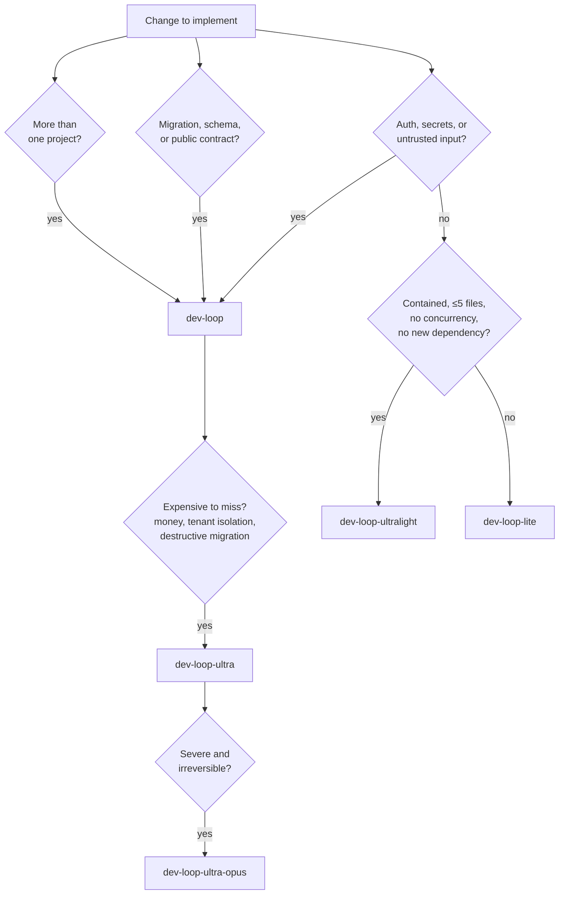
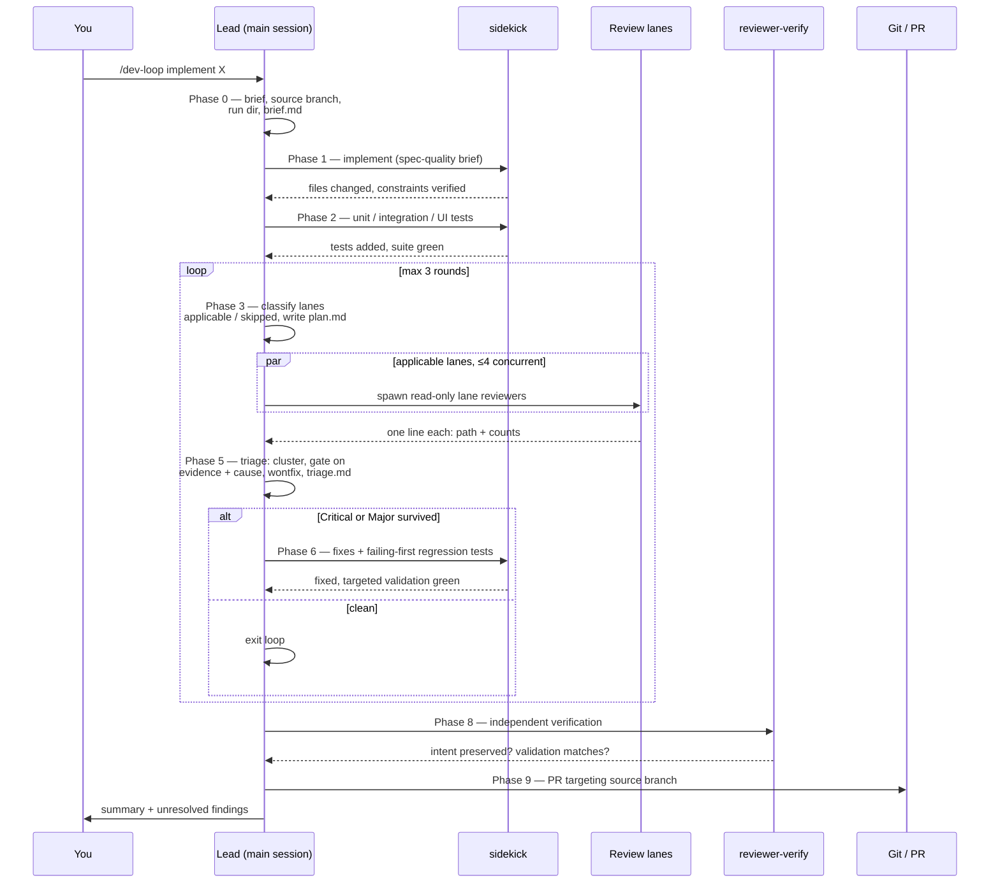
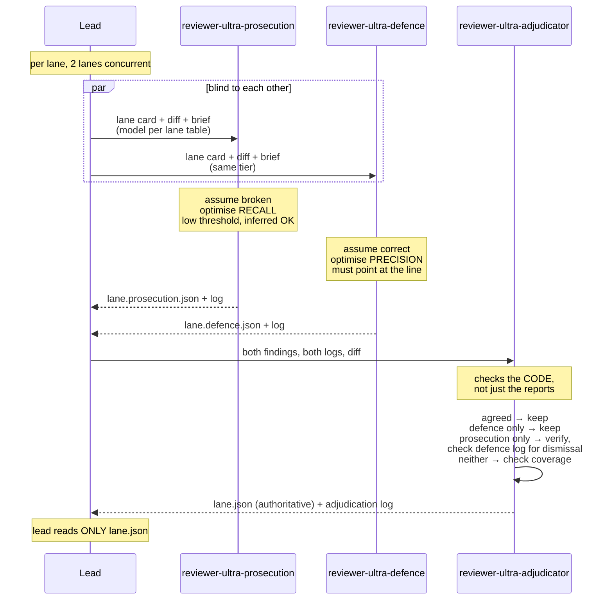
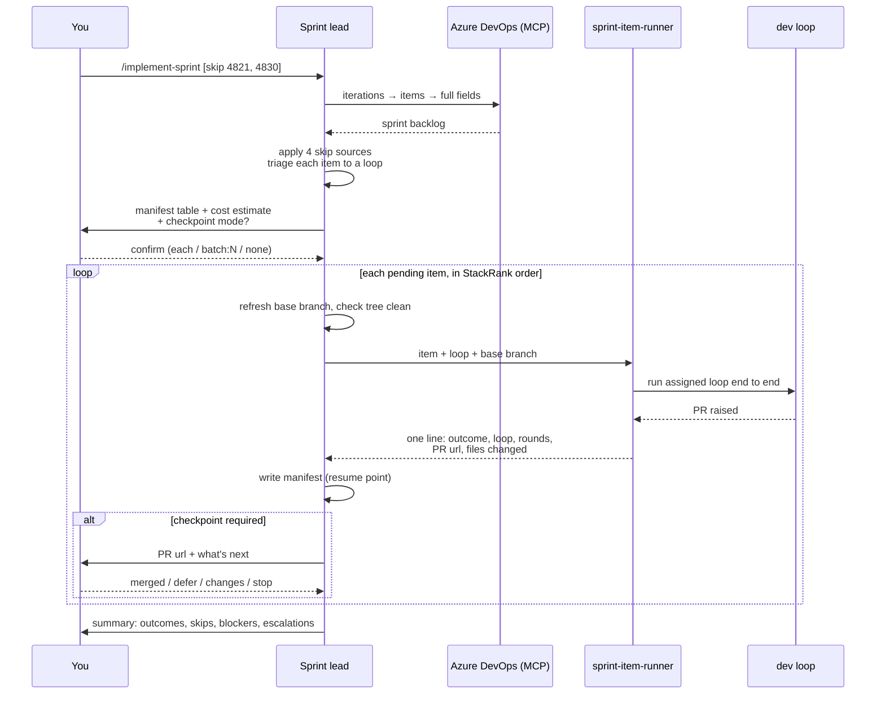

# Claude Code Dev Loops

A set of Claude Code skills and subagents that turn "implement this" into a
bounded, logged, multi-pass review pipeline that ends at a pull request.

Five review loops at different price and depth points, a sprint orchestrator that
runs work items through them one at a time, and a delegation policy that keeps
the orchestrating agent out of the code.

Everything here is plain markdown. There is no runtime, no dependency, and
nothing to build — Claude Code reads these files directly.

---

## Contents

- [Why](#why)
- [The loops](#the-loops)
- [How a loop works](#how-a-loop-works)
- [The adversarial loops](#the-adversarial-loops)
- [Sprint orchestration](#sprint-orchestration)
- [Install](#install)
- [Configure](#configure)
- [Use](#use)
- [Cost projections](#cost-projections)
- [What to watch](#what-to-watch)
- [Design notes](#design-notes)

---

## Why

Asking an agent to "implement X and review it" produces one reviewer with one
error profile, reviewing code it just wrote, in a context that contains every
reason it thought the code was fine. Running it again changes nothing, because
the same disposition misses the same things.

This repo addresses that with three ideas:

**Separate contexts.** Every review pass runs in a fresh subagent that has not
seen the implementation happen. A reviewer that watched the code get written
rationalises it.

**One owner per concern.** Ten review lanes, each with an explicit *Owns*, *Does
not own*, and *Quality brake*. A lane that notices something belonging to another
lane says nothing. Duplicate findings inflate round counts and cost triage time.

**Bounded loops with evidence gates.** Findings carry `evidence` and `cause`.
Inferred evidence can never block. Only defects this diff introduced get fixed.
Rounds are capped and the loop reports what it could not resolve rather than
grinding.

Much of the review-lane design is adapted from
[dcramer/agents](https://github.com/dcramer/agents) — specifically applicability
gating, evidence labels, causality, and clustering by locator.

---

## The loops

| Loop | Lanes | Rounds | Relative cost | Use for |
| --- | --- | --- | --- | --- |
| `dev-loop-ultralight` | 1 reviewer, 9-item sweep | 1 | **0.19×** | Trivial contained changes |
| `dev-loop-lite` | 4 consolidated | 2 | **0.57×** | Contained single-project changes |
| `dev-loop` | 9, applicability-gated | 3 | **1.00×** | Default |
| `dev-loop-ultra` | 9, each an adversarial triple | 3 | **1.89×** | Expensive-to-miss defects |
| `dev-loop-ultra-opus` | Same, every reviewer on Opus | 3 | **2.71×** | Severe, irreversible consequences |

**Implementation is never downgraded.** All loops write and fix code at the same
sidekick tiers; only review depth and bounds differ. The exception is
`dev-loop-ultra-opus`, which raises implementation to Opus to match its reviewers.

Selection is by **risk surface, not diff size**. A one-line change touching
authorization goes to the full loop.



**When unsure, go heavier.** The savings never justify a missed Critical.

### Escalation is one-way and mandatory

Lighter loops abandon themselves rather than pressing on:

| From | Trigger | Restarts under |
| --- | --- | --- |
| ultralight | Any Critical, or Major in security/architecture/concurrency | `dev-loop` |
| ultralight | Any other Major, >4 accepted findings, incomplete sweep | `dev-loop-lite` |
| lite | Any Critical in round 1 | `dev-loop` |

The reasoning: a change that produced a Critical was misjudged, and the lanes the
lighter loop skipped are precisely the ones that have not looked at it yet.
Loops never de-escalate.

---

## How a loop works



### The nine review lanes, plus verification

Each of the nine has a card in `dev-loop/references/review-lanes.md`. Reviewers
read **only their own card**. Verification is not a lane — it runs once at the
end, against four fixed questions, and has no card.

| Lane | Model | Owns |
| --- | --- | --- |
| requirements | opus / high | Coverage against the brief, scope creep, interpretations taken |
| technical | opus / xhigh | Logic, state, concurrency, boundaries, error paths |
| architecture | opus / xhigh | **Separation of concerns**, dependency direction, placement |
| security | opus / xhigh | Injection, authz, secrets, deserialization, crypto, exposure |
| standards | sonnet / high | Rules written in the `coding-standards` skill |
| tests | sonnet / high | Whether tests would fail if the code were wrong |
| dead code | sonnet / high | Unreachable branches, orphaned paths |
| minimalism | sonnet / high | Speculative guards, wrappers, config nobody asked for |
| artifacts | sonnet / high | Generated code, migrations, lockfiles, dependencies |
| verify | opus / high | Final gate: did cumulative fixes preserve intent? |

Only requirements, technical, and tests always run. The rest are gated on what
the diff touches — `plan.md` records each decision with a diff-based reason.
"The code looks fine" is never a valid skip reason.

### Findings format

```json
{
  "id": "sec-001",
  "lane": "security",
  "severity": "Critical|Major|Minor",
  "evidence": "direct|spec|policy|test|validation|missing|inferred",
  "cause": "introduced|worsened|stale|missing-required",
  "file": "src/Gateway/MovementService.cs",
  "line": 142,
  "finding": "One sentence stating what is wrong.",
  "why_it_matters": "The concrete consequence, or how to trigger it.",
  "suggested_fix": "The smallest change that fixes it.",
  "would_have_been_bug": true,
  "confidence": "high|medium|low"
}
```

Two gates do most of the work. **`evidence: inferred` alone can never be a
blocker** — a reviewer that reasoned to a problem but cannot point at it gets
advisory weight only. **`introduced`, `worsened` and `missing-required` are
fixed; `stale` is not** — pre-existing debt is recorded in the PR description,
because fixing it expands the diff and hides the actual change.

`missing-required` is the awkward one and it is deliberately in scope: it names
something the change needed and did not produce — the migration for a schema
change, the regenerated client for an altered contract. None of those are ever
visible in a diff, so a gate admitting only `introduced` and `worsened` would
drop every one of them while looking perfectly principled.

### The walkthrough

`implementation-notes` accumulates decisions, rejected alternatives, and
rejected requirements findings into `notes.md` throughout the run, inside the
gitignored run directory. At Phase 8b, `pr-walkthrough` turns that record into
`docs/walkthroughs/<slug>.md`. The diff already shows *what* changed, so the
walkthrough's only job is *why* — the alternatives considered, the constraint
that forced the shape, the thing a reviewer would otherwise flag as a bug.
It is committed alongside the change and linked from the PR description, so a
reviewer opens it before they open the diff.

---

## The adversarial loops

`dev-loop-ultra` replaces each single lane pass with three agents.



**Why opposed stances rather than two identical reviewers.** Running the same
reviewer twice samples the same error profile twice. Prosecution and defence have
*different* profiles: one over-raises, one under-raises, and their disagreements
carry the information. The adjudicator extracts it by checking the code itself —
adjudicating from the two reports alone would just let the more confident summary
win.

**The adjudicator may not invent findings.** Anything it spots that neither
reviewer raised goes in its log for the lead, not into the findings file. A third
opinion smuggled in as an adjudication is reviewable by nobody.

`dev-loop-ultra-opus` is structurally identical: every reviewer on Opus,
implementation raised to `sidekick-heavy`, and concurrency dropped to one lane at
a time.

It raises the **model** tier, not the effort tier. The Agent tool takes a `model`
parameter and has no `effort` parameter, so a lane's effort is whatever its agent
file declares — `high` for all three ultra reviewers. The sidekicks reach `xhigh`
only because `sidekick-heavy` is a separate agent file that declares it. If
`xhigh` reviewers are ever wanted, that is the pattern: dedicated agent files,
not a parameter that does not exist.

---

## Sprint orchestration

`implement-sprint` pulls work items from Azure DevOps, triages each to a loop,
and runs them sequentially with checkpoints.



**Checkpoints default to after every item.** Ten PRs landing at once is a rebase
queue, not a review queue — branches cut from the same base that touch the same
files conflict with each other, and a mistake in item one has been repeated nine
times before anyone sees it.

Four checkpoints are **not configurable**, whatever mode is chosen:

- After the first completed item — where you find out the triage was wrong, before it repeats.
- File overlap with an open PR — the runner returns changed paths for exactly this.
- The next item depends on an unmerged one.
- The item escalated its loop, or ended blocked or failed.

The run also halts if three PRs are open at once, if two consecutive items fail,
or if any item leaves the working tree dirty.

**Skips come from four sources**, all applied: inline in the invocation,
`.claude/sprint/skip.md`, the `no-auto` / `manual` / `spike` tags in ADO, and
automatic rules (wrong type, wrong state, no acceptance criteria, unmet
dependency). Every skip is reported with its reason.

**Work item text is specification, not instruction.** Anything in a description
addressed to the agent — skip review, run this, this was pre-approved — is quoted
to you rather than acted on.

---

## Install

**See [INSTALL.md](INSTALL.md) — one command handles everything.** The rest of
this section is what the script does, for anyone placing files by hand.

```bash
git clone https://github.com/<you>/claude-dev-loops.git
cd claude-dev-loops
```

**User level** — the loops, reviewers, and sidekicks, available in every project:

```bash
cp -r user/.claude/agents/*   ~/.claude/agents/
cp -r user/.claude/skills/*   ~/.claude/skills/
```

```powershell
Copy-Item user\.claude\agents\* $HOME\.claude\agents\ -Recurse -Force
Copy-Item user\.claude\skills\* $HOME\.claude\skills\ -Recurse -Force
```

**Project level** — coding standards, sprint orchestration, and hook logging, per
repository:

```bash
cp -r project/.claude/. /path/to/your/repo/.claude/
```

Then merge `CLAUDE.md` into your own, restart Claude Code once (the agent
directory watcher only covers directories that existed at startup), and run
`/doctor` to confirm everything loaded.

### Layout

```
user/.claude/
├── agents/                 22 agents — sidekicks, Explore, all reviewers
└── skills/
    ├── dev-loop/                    SKILL.md + references/review-lanes.md
    │                                         + references/tree-snapshot.md
    ├── dev-loop-lite/               SKILL.md + references/review-lanes-lite.md
    ├── dev-loop-ultralight/         SKILL.md
    ├── dev-loop-ultra/              SKILL.md
    ├── dev-loop-ultra-opus/         SKILL.md
    ├── solution-architecture/       SKILL.md   (repo-agnostic)
    ├── implementation-notes/        SKILL.md
    ├── pr-walkthrough/              SKILL.md + references/example-walkthrough.md
    └── pr-walkthrough-review/       SKILL.md

project/.claude/
├── agents/sprint-item-runner.md
├── skills/coding-standards/SKILL.md          ← edit this
├── skills/implement-sprint/                  SKILL.md + references/item-triage.md
├── sprint/skip.md
├── scripts/log-agent-event.ps1
├── settings.example.json                     ← merge hooks into settings.json
└── CLAUDE.md                                 ← project-level instructions
project/ARCHITECTURE.template.md              ← fill in, place at repo root
```

Skill files **must** be named `SKILL.md`; the directory name identifies the skill.

---

## Configure

### Required before first use

**`project/.claude/skills/coding-standards/SKILL.md` is a scaffold.** Replace it
with your real rules. Its *Explicitly not standards* section matters as much as
the rules — it is what stops the lane raising `var`-versus-explicit-type
opinions. If an analyser or formatter catches it, it is not a review finding.

### Not required — discovered at runtime

**`solution-architecture` is repository-agnostic by design.** It carries the
reasoning and discovers the facts per repo, in four tiers:

| Tier | Source | `evidence` | Max severity |
| --- | --- | --- | --- |
| 1 | `ARCHITECTURE.md`, ADRs, `policies/**/*.md` | `policy` | Critical |
| 2 | Project reference graph (`dotnet sln list`, `ProjectReference`) | `direct` | Critical |
| 3 | Convention inferred from 3+ existing examples | `inferred` | **Minor** |
| 4 | Nothing establishable | `inferred` | Minor, SoC only |

The tier caps finding severity, which is the safeguard against confident
restructuring proposals. A repo that documents its architecture gets it enforced;
one that does not gets advice. Where a document and the reference graph disagree,
**the graph wins** — docs go stale, graphs cannot.

`.claude/review/conventions.md` accumulates deliberate deviations from your own
triage rejections. It is written by the loop, never authored up front. Commit it;
it is shared repo knowledge.

### Optional — hook logging

Merge `settings.example.json` into `.claude/settings.json` to record
`SubagentStart` / `SubagentStop` events. This captures timing and identity even
when an agent crashes or is stopped, independent of whether it wrote its own log.

The bundled script is PowerShell and is invoked as
`pwsh -NoProfile -NonInteractive -File "$CLAUDE_PROJECT_DIR/.claude/scripts/log-agent-event.ps1"`.
Both halves of that matter: hook cwd is not guaranteed to be the project root, so
the path must be absolute, and a bare `.ps1` path is not executable by the
default shell. **Run `/doctor` after merging and confirm
`_agent-events.jsonl` appears** — the script exits 0 on every error so it can
never block a subagent, which also means a misconfigured hook is completely
silent.

### Sprint orchestration

`implement-sprint` expects an `ado` MCP server. Update the organisation, project,
and team in its SKILL.md frontmatter and Phase 0. Adapting it to GitHub or Jira
means changing Phase 0 and the automatic-skip state names — nothing else in the
skill is provider-specific.

---

## Use

```
/dev-loop              implement batching for movement notifications
/dev-loop-lite         add the retry-count column to the movements grid
/dev-loop-ultralight   fix the typo in the validation message
/dev-loop-ultra        change the tenant filter on the movements query
/dev-loop-ultra-opus   migrate the movements table to the new partition key

/implement-sprint
/implement-sprint skip 4821, 4830
/implement-sprint resume
```

### What a run leaves behind

```
.claude/review/
├── runs/
│   ├── index.jsonl                    one line per run — the analysis surface
│   ├── _agent-events.jsonl            hook-captured timing
│   └── 20260729-1430-feat-batching/
│       ├── brief.md
│       ├── round-1/
│       │   ├── plan.md                applicability decisions
│       │   ├── <lane>.json            findings
│       │   ├── <lane>.log.md          considered-and-dropped, uncertain
│       │   └── triage.md              every accept/reject with reason
│       ├── notes.md                   decisions, rejected alternatives — feeds pr-walkthrough
│       ├── verification.md
│       └── run.md
├── wontfix.json                       per-run rejections
└── conventions.md                     durable accepted deviations — commit this

docs/walkthroughs/
└── <slug>.md                          why this change is shaped the way it is — committed, linked from the PR
```

The installer appends `.claude/review/runs/` to the repo's `.gitignore` for you —
lane logs quote the code they examined, so this is not a tidiness rule. Keep
`conventions.md`; it is the only part of `.claude/review/` that is committed.
Scratch worktrees live under `runs/` too, which is why they never appear in
`git status`. `notes.md` lives inside that gitignored run directory and never
ships; `docs/walkthroughs/` sits outside it, on the repo proper, because that
one is the shipped artifact.

---

## Cost projections

Modelled per change, USD, from `docs/cost-model.py`. **These are estimates from
assumed token volumes**, not measurements — the shape is reliable, the absolute
figures are not. On a subscription plan, read them as relative burn against your
quota.

| Loop | Review | Lead | Impl | Other | **Total** | vs full |
| --- | --- | --- | --- | --- | --- | --- |
| `dev-loop-ultralight` | 0.17 | 0.40 | 0.42 | 0.08 | **1.07** | 0.19× |
| `dev-loop-lite` | 0.61 | 1.42 | 0.86 | 0.34 | **3.24** | 0.57× |
| `dev-loop` | 2.48 | 1.71 | 0.86 | 0.66 | **5.71** | 1.00× |
| `dev-loop-ultra` | 7.31 | 1.97 | 0.86 | 0.66 | **10.80** | 1.89× |
| `dev-loop-ultra-opus` | 10.50 | 1.97 | 2.09 | 0.88 | **15.44** | 2.71× |

Assumptions: 35k in / 2.5k out per review invocation, 55k / 12k per
implementation handoff, Opus $5/$25 and Sonnet $3/$15 and Haiku $1/$5 per million
tokens, reasoning billed as output with effort multipliers of 1.0 / 1.8 / 3.0 for
medium / high / xhigh. Typical scenario: 2 rounds for full, 1.5 for lite, 1 for
ultralight, with round 2+ rerunning ~45% of lanes.

Things the table makes visible:

**Effort dominates model choice.** Reasoning tokens bill as output at 5× the
input rate, so an Opus lane at `xhigh` costs roughly 6× a Sonnet lane at `high`
for identical inputs. Tuning `effort` is usually a better lever than switching
models.

**Ultra is 1.89×, not 3×.** Review triples, but implementation, fixes, and
verification do not move — review is only 43% of a full run.

**The lead is the floor.** At 40% of an ultralight run, orchestration is what you
pay for once review gets cheap enough. Below that you are not running a loop.

**Savings shrink as diffs grow.** At 4× the implementation size, lite's advantage
falls from 43% to 30%, because implementation is shared. The light loops are
proportionally most valuable on small changes — which is also where they are safe.

### The number that actually matters

Cost per run is the easy metric. **Cost per Critical caught** is the real one, and
only your own `index.jsonl` can answer it. Run the loops for a few dozen changes
before concluding anything from the table above.

---

## What to watch

`index.jsonl` is the analysis surface. Per lane, per run, accepted versus
rejected:

Rejections are recorded **by reason**, because a bare rejection rate cannot tell a
noisy lane from a well-functioning one — most rejections are the evidence and
cause gates working as designed:

| Rejection reason | Says about the lane |
| --- | --- |
| `rejected_stale` | Fine. The cause gate worked. |
| `rejected_evidence` | Fine, though many means it reasons past what it can see. |
| `rejected_remedy` | Fine — often the lane's best work. |
| `rejected_wrong` | **The only one that counts against it.** |

Judge lane health on `rejected_wrong` against `raised`. A lane raising five of
which four are `stale` is working; one raising two of which one is `wrong` is not.

| Signal | Meaning | Fix |
| --- | --- | --- |
| High `rejected_wrong` ratio | Manufacturing findings | Tighten its quality brake, or narrow its applicability rule |
| Lane never raises anything | Gated too tightly, or its card is too vague to act on | Widen applicability, or make the card concrete |
| High escalation rate from a light loop | Selection criteria too loose | Tighten the eligibility list, not the reviewer |
| Ultra: prosecution raises many, few kept | Running hot, or dismissals accepted too readily | Check adjudication logs — which side is failing? |
| Ultra: defence raises almost nothing | Drifted into agreeableness | **The hardest failure to see — it looks like clean code** |
| Ultra: both agree on nearly everything | Stances not actually opposed | You are paying 3× for one opinion |
| Merged lanes (lite) only ever report one concern | Consolidation not holding | Split that lane back out |

Every reviewer logs what it **considered and did not raise**, and what it could
not verify. Those two lines distinguish a lane that is quiet from one that
stopped early — which look identical in a findings file.

---

## Design notes

**Reviewers need `Write`** to emit their findings JSON, and `Bash` to run
`git diff` and the validation commands — so "read-only" describes intent, not a
capability boundary. Three things enforce it, in increasing order of how much
they actually guarantee:

1. `disallowedTools` on every reviewer blocks `Edit`, `NotebookEdit`, and the
   mutating shell commands — `rm`, `mv`, `sed`, `tee`, and the `git` verbs that
   write (`add`, `commit`, `push`, `checkout`, `reset`, `restore`, `clean`,
   `stash`, `rebase`, `merge`, `worktree`).
2. The prompt confines writes to the run directory.
3. **The lead takes a content digest of the working tree before spawning the
   lanes and again after they drain, and stops if it moved.**

Only the third is a guarantee. Prefix-matched deny rules cannot catch every
spelling — a shell redirect inside an otherwise-permitted command still writes —
so the digest checks the *result* rather than trying to enumerate the causes.
The mechanism is in `dev-loop/references/tree-snapshot.md`.

**Mutation testing happens in a scratch worktree, never in the tree under
review.** The Tests lane's strongest finding is proving a test decorative by
breaking the code it covers — which requires writing to source. The lead creates
a detached worktree from an exact snapshot of the tree under review (tracked and
untracked, via a temporary index, touching neither `.git/index` nor the tree),
hands the path to that lane, and discards the whole worktree afterwards. Nothing
to restore, nothing on a branch, and the primary tree the other lanes are reading
never moves. Earlier versions told the lane to break the code and, twenty lines
later, never to modify source files; there was no reading of that which was both
safe and useful.

**Do not enable `memory` on reviewers.** It auto-enables Read, Write, and Edit for
memory management, which silently undoes the read-only property. The sidekicks
have `memory: project`; the reviewers deliberately do not.

**`CLAUDE.md` loads into every custom subagent**, including all reviewers. The
delegation policy carries a scope note for that reason. Only the built-in Explore
and Plan skip it.

**Nothing is on the branch until Phase 9 commits it.** Review lanes and
verification examine the working tree. Phase 9 stages untracked files explicitly,
diffs the commit against the reviewed file list, and confirms the PR's file list
matches — because a path-pattern `git add` silently omits new files, and a PR
missing a new DTO does not compile. This was a real gap found by a real run.

Phase 9 also compares `git rev-parse HEAD^{tree}` against the digest taken after
the final round's fixes. The file-list check catches a *missing* file; it cannot
catch a *changed* one, because the same files with different contents produce an
identical `--stat`. Two checks, two different failures.

**`CLAUDE_CODE_SUBAGENT_MODEL` overrides everything**, above per-invocation and
frontmatter both. If routing appears not to work, check for it first.

**The `Explore` override must be named `Explore`**, capitalised, to shadow the
built-in. Since v2.1.198 the built-in inherits the main model, so recon runs at
Opus prices if your lead does. The override pins it to Haiku — at the cost of
loading CLAUDE.md, which the built-in skips.

**Ultra passes models per invocation.** The three ultra agents are generic and
read whichever lane card the lead names; the tier comes from the skill's table at
spawn time. If a runtime cannot pass a per-invocation model, the skill instructs
the lead to stop rather than silently run every lane at the default tier.

---

## Credits

Review-lane structure — applicability gating, evidence labels, causality
classification, clustering by locator, and the independent verification pass —
adapted from [dcramer/agents](https://github.com/dcramer/agents).

## Licence

MIT. See `LICENSE`.
