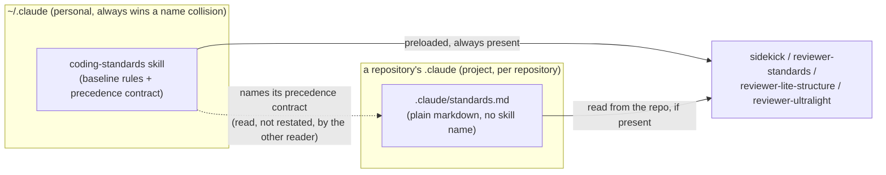
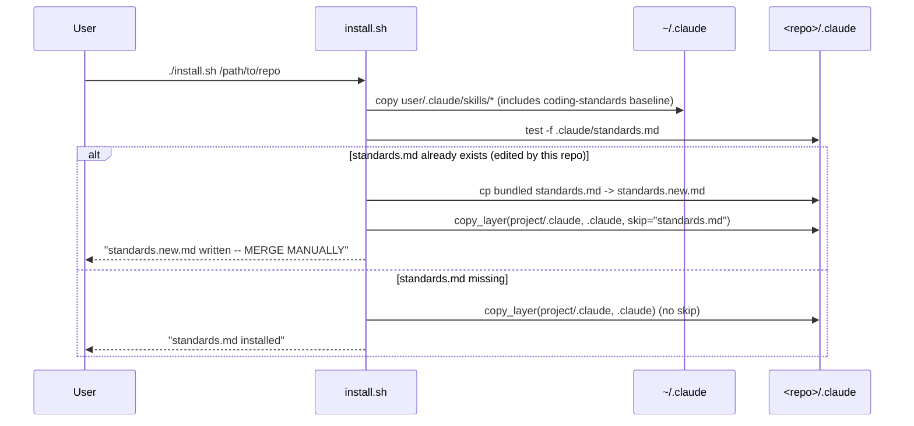

# Walkthrough: coding standards baseline + per-repo override

**Branch:** `feat/standards-baseline-override` · **Diff base:** `main` (`f506461`) ·
**Change is uncommitted working tree** (loop `20260818-standards-override`, `lite`).

Claude Code resolves skill name collisions by source, and **personal
(`~/.claude/skills/`) always overrides project (`.claude/skills/`)** — whole-skill
shadowing, not a merge. The bundle shipped `coding-standards` as a project-level
skill. Any user who already had a personal `coding-standards` skill got it silently
in every repository, and the project's real rules were never read — this machine
was in exactly that state, and the two copies had already drifted (the personal
copy carried a 120-character rule the bundled one did not). Nothing reports the
shadowing; a review just quietly runs against the wrong document. This change makes
the user-level skill the baseline **and the loader**, and moves per-repository rules
to a plain `.claude/standards.md` — a different mechanism, so it cannot collide.

**Out of scope:** no agent card's lane ownership or tiering changed, and
`~/.claude/` on this machine was never written to — every install in this
change ran against a redirected `$HOME`. One rule's *content* did change: the
baseline enforced a 120-character MUST while also listing line length under
*Explicitly not standards* — a standing contradiction, fixed by narrowing the
exclusion bullet rather than dropping the 120-character rule, which the brief
named as the thing not to regress. `graphify-out/`'s stale
references to the deleted `project/.claude/skills/coding-standards/` path are
deliberately not fixed here; see Decisions.

## Architecture

Before this change, `project/.claude/skills/coding-standards/` and
`~/.claude/skills/coding-standards/` shared one name and collided; the diagram's
right-hand box did not exist as a distinct mechanism, it was a second skill
fighting the first one for the same slot. After this change the two boxes have
different addresses, so there is nothing left to collide.

## Sequence — installing into a repository that already has a customised `standards.md`

`standards.md` is never a copy target when it already exists — it is excluded
from the bulk copy rather than overwritten and restored. That ordering (the
`.new` file lands *before* the bulk copy runs) is the entire fix for the
data-loss defect described under Decisions below.

## Change table

| File | Change | Notes |
| --- | --- | --- |
| `user/.claude/skills/coding-standards/SKILL.md` | New — baseline rules (unchanged content) plus a new "Precedence with the per-project override" section and the four-clause contract | The loader; see Decisions |
| `project/.claude/skills/coding-standards/SKILL.md` | Deleted | Was the collision; replaced by the file below |
| `project/.claude/standards.md` | New — headings and prose only, zero active rules; its own combining section is gone, replaced by a one-line pointer at the skill's precedence section | See Decisions ("why it ships empty" and "why the contract lives in one file") |
| `project/.claude/CLAUDE.md:12` | One-line rewrite of the standards-source summary | Kept in sync with `user/CLAUDE.md:21`, see `corr-004` |
| `user/CLAUDE.md:21` | Same rewrite, user-level copy | Third place the contract's summary lives; see Decisions |
| `install.sh` | New `copy_layer` (L37–50) skip-one-entry copy; new standards guard (L90–119) writes `.new` before the destructive copy, never restores | Core of the data-loss fix |
| `install.ps1` | `Copy-Tree` gains an `$exclude` param (L33–45); new standards guard (L87–116), same shape as bash | Core of the data-loss fix |
| `INSTALL.md` | Manual-steps section split into "once per machine" (baseline) vs. "per repository" (`standards.md`); skill/agent counts updated to 11/22 | Narration of the new contract, no behaviour |
| `README.md` | Layout tree, required-before-first-use section, and the manual `cp -r` install path all updated; manual-install caveat added at L359–363 | The manual-path caveat closes `corr-006`/`sec-003`, see Decisions |
| `user/.claude/agents/reviewer-standards.md:42–46` | Reads both files, combines per the skill's precedence section, names the source file per finding | A8, see Decisions |
| `user/.claude/agents/reviewer-lite-structure.md:48` | "Then the preloaded coding standards" → "Then the `coding-standards` skill and `.claude/standards.md`" | A8 |
| `user/.claude/agents/reviewer-ultralight.md:79–83` | Same combine-and-name-source change as `reviewer-standards.md` | A8 |
| `user/.claude/skills/dev-loop/references/review-lanes.md:80–91` | `## Standards` card's Owns/Does-not-own/Quality-brake rewritten for two files; the Does-not-own bullet's own restatement of the exclusion clause was later collapsed to a pointer at the skill's precedence section | A8, primary card; see "why the contract lives in one file" in Decisions |
| `user/.claude/skills/dev-loop-lite/references/review-lanes-lite.md:52–72` | Same card rewrite for the lite loop; the combine rule was **deleted and replaced with a pointer** to the skill's own section rather than restated | See "fix drift by restating less" in Decisions |
| `tests/install-contract.sh` | New — 15 assertions against the real installer | See Tests |
| `tests/install-contract.ps1` | New — 15 assertions, same contract | See Tests |
| `.claude/review/conventions.md` | New — records the `graphify-out/` staleness as examined-and-accepted | Ignore this for review purposes — accumulates from triage, not authored speculatively |
| `graphify-out/**` (7 hits in `graph.json`, plus `GRAPH_REPORT.md`, `graph.html`, `manifest.json`, `stat-index.json`, three semantic cache entries) | Not touched | **Ignore this** — deliberately stale, see `conventions.md` and Decisions |

## The flow

| Entrypoint | Trigger | First changed file it reaches |
| --- | --- | --- |
| `./install.sh /path/to/repo` or `.\install.ps1 -Repo ...` | User runs the installer | `install.sh` / `install.ps1` |
| `coding-standards` skill invocation | A sidekick or reviewer preloads the skill while writing or reviewing code | `user/.claude/skills/coding-standards/SKILL.md` |

This change has two entrypoints, not one, because it changes two things that
never talk to each other at runtime: how the two rule files get onto disk, and
how a reader combines them once they're there. The walkthrough follows both.

### 1. `install.sh` / `install.ps1` — getting the two files onto disk without destroying either

`install.sh:97–119` (`install.ps1:95–116` is the PowerShell equivalent) is
where a repository first acquires `.claude/standards.md`. Before this change,
the same job was done by an unconditional `cp -r project/.claude/. <repo>/.claude/`
— the whole project layer, standards file included, landed on top of whatever
was already there.

The guard checks `Test-Path`/`[ -f ]` on the destination first. If the file
already exists, the bundled version is written to `standards.new.md`
(`install.sh:104`, `install.ps1:99`) **before** anything destructive happens,
then `copy_layer`/`Copy-Tree` runs with that one filename excluded
(`install.sh:105`, `install.ps1:103`), so the bulk copy never touches
`standards.md` at all. If it's a fresh install, the bulk copy runs without an
exclusion and `standards.md` lands as part of it, once.

**This calls into `copy_layer` (`install.sh:41–50`) / `Copy-Tree`
(`install.ps1:33–45`), which is worth reading next** — it's a small,
general-purpose "copy this directory except one entry" primitive, and the
reason it exists as a primitive at all (rather than `cp -r` plus a restore) is
the data-loss defect covered in Decisions.

### 2. `coding-standards` SKILL.md — combining the two files at read time

`user/.claude/skills/coding-standards/SKILL.md`, "Precedence with the
per-project override" (L15–53), is where a reader — sidekick or reviewer —
learns how to combine the baseline it's preloaded with and the
`.claude/standards.md` it has to go looking for in the repo. The four-clause
contract at L30–40 is deliberately flat and parallel: **wins** (same subject,
project file wins), **still applies in full** (uncovered subject, baseline
stands), **removed outright** (project file's own exclusion list), **must
never be raised** (in neither file). See Decisions for why it's phrased this
way rather than as prose.

Five consumers of that contract were edited to actually read both files
instead of one — `reviewer-standards.md:42–46`, `reviewer-lite-structure.md:48`,
`reviewer-ultralight.md:79–83`, and the two lane-card files
(`review-lanes.md:80–91`, `review-lanes-lite.md:52–72`). None of them
re-derive the contract; each points at or restates a source-naming
requirement and leaves the combining logic to the skill.

## Decisions

### Why the contract is stated in exactly one file

- **Decided:** The precedence contract — precedence, narrowing, exclusion,
  attribution — is stated once, in
  `user/.claude/skills/coding-standards/SKILL.md:15–53`. Every other file that
  touches the idea — `project/.claude/standards.md`, both lane-card files,
  three agent cards — names that section and makes no claim of its own about
  how the two files combine. `project/.claude/standards.md` no longer has a
  combining section at all; what's there describes the file's own purpose —
  repository-specific rules, ships empty, empty is the intended default, what
  each heading is for.
- **This was not the first draft.** The original reasoning for a second copy
  was real: an editor of `.claude/standards.md` needs to know how their edits
  combine without first discovering a skill they may not know exists. That
  reasoning produced a second full statement of the contract in
  `standards.md`'s own "How this combines" section — and two full statements
  of one contract turned out to be a standing invitation to drift, not a
  convenience.
- **It drifted three times inside a single change, not eventually.**
  `struct-001` (round 1): the skill matched a project rule against the
  baseline "on the same subject"; the scaffold's copy matched it "under a
  matching heading" — non-equivalent, and invisible until a repository
  actually populated `standards.md`. `struct-003` (round 2): a lane card's own
  restatement of the exclusion clause had drifted broader than the skill's.
  Independent verification, after both fixes: the skill contradicted
  *itself* — "not written **here**" against its own "in **neither** file"
  thirteen lines above, in the one file meant to be authoritative. Three
  drifts, three different pairs of documents, one review loop.
- **The class stayed open because each drift was fixed at the instance, not
  the source.** The loop restarts when the same concern is raised and fixed
  twice — that rule fired on this contract at round 2 and was logged as an
  interesting pattern rather than acted on. Verification's finding, inside the
  contract's own home file, was the evidence the class was still live; the
  user called it rather than let a fourth fix ship next to a fifth
  restatement. One more leftover surfaced while carrying the collapse out:
  `review-lanes.md`'s *Does not own* bullet still asserted "the project
  file's section can switch off a rule the baseline still carries" — now
  "resolved per the skill's precedence section."
- **The fix is separation of concerns, not extra caution.** The skill owns
  *how the two files combine*; the scaffold owns *how to use this file*. The
  scaffold makes no normative claim about combination at all — there is
  nothing left in it that can drift against the skill.
- **Alternatives considered and rejected:**
  - *A short summary in the scaffold, pointing at the skill for detail.*
    Rejected — a summary is a fourth restatement and drifts exactly like the
    three it would replace; every fix above shows the mechanism, not the
    wording, was the problem.
  - *A single skill under a different name at the project level*, and a
    *merging `~/.claude/rules/` + `.claude/rules/` pair with symlink support*
    — both weighed when the two-file mechanism (skill + `standards.md`) was
    first chosen, not part of this collapse. The former was rejected because
    nine agent cards and both `CLAUDE.md` files already reference the bare
    name `coding-standards`; the latter because rules load into every
    session's context whether or not code is under review, forfeiting the
    lazy loading that makes a long standards document cheap, and because
    symlinks need Developer Mode on Windows, this bundle's primary platform.

### Why the installers delete the backup/restore instead of fixing it

- **Decided:** Neither installer ever writes over an existing
  `standards.md` and restores it afterward. `standards.md` is excluded from
  the bulk copy outright (`install.sh:41–50`, `install.ps1:33–45`), and the
  bundled version is written to `.new` **before** the bulk copy runs, so a run
  that dies partway through has already satisfied the non-clobber contract.
- **Why this is the *only* correct remedy, not a stylistic preference over
  triage's suggestion:** round-1 review (`A3`) found the original
  backup-then-bulk-copy-then-restore sequence had a window between the
  overwrite and the restore — anything that could interrupt the process there
  (permission error, full disk, antivirus lock, Ctrl-C) destroyed the file the
  whole contract exists to protect. Round-1 triage's chosen remedy (`A2`) was
  "make the PowerShell restore byte-preserving." The fix agent (`sidekick-heavy`)
  implemented the exclusion instead and flagged the deviation; it was accepted
  because **A2 and A3 are the same wound treated at two different points**: any
  restore, however byte-perfect, still has a window between the overwrite it's
  restoring from and the restore completing, and that window is exactly what
  A3 is about. The two remedies are mutually exclusive — you cannot make a
  restore both safer and irrelevant at once, and only "irrelevant" closes the
  hole for every failure mode, not just the byte-fidelity one.
- **Alternatives considered:** `trap EXIT/INT/TERM` plus `try`/`finally`,
  rejected because it shortens the window rather than removing it, and a
  handler that can also fire on the success path was a separate requirement
  violation; an on-disk `mktemp` backup with its path printed, rejected as
  "recoverable" being strictly weaker than "untouched", and it leaves debris
  on the failure path; staging the bundle to a temp tree and deleting
  `standards.md` before copying, rejected as doubling the copy and adding a
  temp tree to clean up for no benefit over exclusion; `[IO.File]::ReadAllBytes`/
  `WriteAllBytes`, rejected because holding the backup in RAM makes an
  interrupted process's backup unrecoverable by construction; `Copy-Item
  -Exclude -Recurse`, rejected outright — it filters at the wrong level and
  silently drops nested content, which is also why `copy_layer` in bash is a
  loop rather than `cp --exclude` (`cp` has no such flag on GNU or BSD).
- **Verified, not just argued:** independent verification locked
  `standards.md` and confirmed the install completed cleanly (nothing tries to
  touch it), then locked `standards.new.md` to force the write-before-destructive
  step to fail, and confirmed the installer aborts before the bulk copy runs.
  That is testing that the failure mode no longer exists, not just that the
  patch reads correctly.
- **One asymmetry is accepted, not fixed:** `install.sh`'s `copy_layer` walks
  entries via a glob loop; `install.ps1`'s `Copy-Tree` resolves `Get-Item` and
  filters with `Where-Object`. Each is idiomatic for its shell; the brief asked
  for behavioural parity, not implementation parity, and equivalence was
  proven with SHA-256 digests of every installed file — 8 project-layer files
  and 37 user-level files identical across both installers.
- **The PowerShell half of the original defect (`A3`) is closed by reasoning,
  not a demonstrated red-then-green cycle**, and that's stated honestly rather
  than faked: `Copy-Item 'dir\*'` enumerates directories before files,
  alphabetically, so `standards.md` was always copied last under the old code
  and no in-process failure could land between its overwrite and the restore.
  The obvious fault injection — a read-only destination — doesn't reproduce it
  either, because `Copy-Item -Force` clears the read-only attribute first. The
  defect was real (reachable by external interruption, or by a future bundle
  file that happens to sort after `standards.md`), just not exploitable inside
  a single test run. The other three cases — bash data loss, bash `.new`
  contract, PowerShell `.new` contract under a locked-file crash — all got a
  genuine red-then-green cycle; see Tests.
- **The manual install path in `README.md` had the identical hole and it
  wasn't in anyone's original scope.** Correctness and Security independently
  found, from different cards, that the documented `cp -r project/.claude/.
  /path/to/your/repo/.claude/` one-liner bypasses every guard above — it's not
  generated by the same code, so protecting the installer scripts protects
  nothing about the manual path. Two lanes converging from unrelated angles on
  the same gap is much stronger evidence than either alone finding it, and it
  was a surface the brief hadn't named: the change protected the *scripted*
  install path and left the *documented, manual* one wide open. The remedy
  chosen (`README.md:359–363`) was a caveat naming both protected files beside
  the existing manual command, matching the pattern the same paragraph already
  used for `CLAUDE.md`'s hazard — not deleting the manual alternative, which
  some readers deliberately prefer over running a script, and which would have
  been a bigger change than the defect warranted.

### Why `project/.claude/standards.md` ships with zero active rules

- **Decided:** every section of `project/.claude/standards.md` reads "No
  project-specific rules yet" — headings and explanatory prose only, nothing
  under *Explicitly not standards* either.
- **Why this isn't an unfinished file:** the file is read by a model, not
  parsed by a linter. Any example rule placed in it becomes a live rule the
  moment the file is installed — it doesn't stay inert as a "for illustration"
  block the way a code comment might. Shipping even one example would silently
  override the baseline in every repository the bundle touches, which is the
  exact silent-wrong-document failure this whole change exists to remove, just
  relocated from a skill collision to a scaffold nobody edited.
- **The unedited-file case is asserted, not left for the reader to work out.**
  The skill states as fact (`SKILL.md:42–44`) that a `standards.md` shipped
  unedited from its scaffold "combines to no-op automatically." That's only
  true because the file carries zero rule bullets under every heading — the
  assertion and the file's actual emptiness are two ends of the same
  constraint, made to agree by construction rather than by a reader having to
  inspect contents to check whether the combining logic bites.
- **Alternatives considered:** commented-out example rules, rejected for the
  same reason as a live example — a model reading markdown doesn't reliably
  honour "this is only an example" the way a compiler honours a comment token;
  naming it `standards.template.md` and requiring a rename, rejected because
  an un-renamed file (the likely default) means the override path is silently
  dead, which is the same failure mode in a different costume.

### Why five agent cards and lane definitions were edited, when the design's selling point was that none would need to be

- **Decided:** despite the brief listing "editing any agent card or other
  skill" as a non-goal, the fix agent self-raised and fixed a finding (`A8`)
  touching `reviewer-standards.md:42–46`, `reviewer-lite-structure.md:48`,
  `reviewer-ultralight.md:79–83`, `review-lanes.md:80–91`, and
  `review-lanes-lite.md:52–72`.
- **Why the non-goal didn't cover this:** the non-goal's actual claim was that
  no agent card needs editing to make the *name* `coding-standards` keep
  working — that claim holds; nothing about lane ownership, tiering, or the
  skill's invocation changed. What the non-goal never covered was the four
  cards' *prose*, which stated "rules written in the `coding-standards`
  skill" as if that were the only source. Left as-is, that wording would
  actively suppress every rule a repository writes into `.claude/standards.md`
  — "if it's not written there, it's not a finding" reads as a hard stop, not
  a hint to check a second file. The mechanism (two files, one precedence
  contract) works exactly as designed; the four cards' wording would have
  defeated it in production regardless.
- **Why it was accepted rather than deferred:** this is the same class of
  finding as `corr-004` (two `CLAUDE.md` files stating a single-source claim,
  found the same run), which was already accepted — consistency required
  accepting `A8` too, or the run would have fixed the summary docs and left
  the reviewers that actually gate PRs still blind to the second file.
  Shipping the feature next to four reviewer instructions telling every lane
  to ignore it was judged worse than either shipping neither the feature nor
  the wording fix, or shipping both.
- **Scope correction caught late:** the fix agent's own report named three
  files; a grep at triage found a fourth, `reviewer-standards.md:42` (renamed
  from a plain `reviewer-standards.md:43` reference in the original finding) —
  the primary Standards reviewer for the full loop, and the one file where the
  suppression would have bitten hardest had it been missed.

### Why `graphify-out/` staleness was deliberately not fixed

- **Decided:** `graphify-out/graph.json` (7 hits), `GRAPH_REPORT.md`,
  `graph.html`, `manifest.json`, `stat-index.json`, and three semantic cache
  entries all still reference the deleted
  `project/.claude/skills/coding-standards` path, and none of them were
  updated by this change.
- **Why:** `graphify-out/` is a committed, machine-generated knowledge-graph
  cache, rebuilt on demand by the `graphify` skill rather than maintained by
  hand as part of ordinary changes. Regenerating it here would fold a large,
  tangential diff into a change whose actual surface is twelve files.
  `.claude/review/conventions.md` (new this run) records the deviation as
  examined and deliberately accepted, scoped narrowly to path staleness in
  that one directory — it doesn't extend to other generated artifacts, and it
  doesn't cover other concerns (like secrets) that directory might carry.
- **What this means for a reader of the cache today:** until `graphify` is
  re-run, asking it a path question about `coding-standards` will point at a
  file that no longer exists. That's a real, currently-live gap; it's carried
  to Open questions below rather than silently accepted as fine.

### Wording the precedence contract against a second reading

- **Decided:** four flat, parallel bullets (`SKILL.md:30–40`), one per clause,
  each with a single bolded verb — **wins**, **still applies in full**,
  **removed outright**, **must never be raised** — rather than prose that
  states the "same subject" qualifier once and expects the reader to carry it
  through all four cases.
- **Why:** the four cases (same subject / uncovered subject / listed as
  not-a-standard / listed nowhere) partition the space exactly. Prose that
  states the qualifier once invites a reader to detach it — "a rule in the
  project file wins over the baseline," read alone, reads as blanket
  project-file supremacy rather than subject-scoped override. The qualifier
  has to stay welded to the bullet it governs, or the contract becomes
  readable two ways, which is the one thing it can't be.

## Where to look to review this

In priority order:

1. `install.sh:90–119` and `install.ps1:87–116` — the non-clobber guard.
   This is the data-loss fix; everything else is plumbing or documentation
   around it. Confirm `.new` is written before `copy_layer`/`Copy-Tree` runs
   in both, not after.
2. `install.sh:41–50` and `install.ps1:33–45` — `copy_layer` / `Copy-Tree`'s
   exclusion primitive. Confirm the exclusion is by top-level name only and
   the recursive copy of everything else is otherwise unchanged.
3. `user/.claude/skills/coding-standards/SKILL.md:15–53` — the precedence
   contract itself. This is the only place it should be stated in full; every
   other file should point at it by name, not summarise or re-derive it — a
   summary is a fourth restatement (see Decisions).
4. `project/.claude/standards.md` (whole file, 54 lines) — confirm no
   section carries an actual rule under any heading, including *Explicitly
   not standards*, and confirm the file makes no claim of its own about how
   the two files combine beyond naming the skill's precedence section.
5. `README.md:359–363` — the manual-install caveat. Confirm it names both
   `standards.md` and the baseline `SKILL.md` as unconditionally overwritten
   by the hand-copy commands directly above it.
6. `user/.claude/agents/reviewer-standards.md:42–46`,
   `review-lanes.md:80–91`, `review-lanes-lite.md:52–72` — confirm each names
   "which file a rule came from" as a requirement, and none restates the
   combining logic beyond a pointer.

## Tests

`tests/install-contract.sh` and `tests/install-contract.ps1`, 15 assertions
each, both 15/15 green (`verify.log.md`; the bash suite was run through Git
Bash — `%LOCALAPPDATA%\Programs\Git\bin\bash.exe` — because this session's
`bash.exe` is a non-functional WSL wrapper on this machine, not because the
suite itself needed substituting).

Both suites run the real `install.sh`/`install.ps1` against a scratch `$HOME`
and a scratch target repo — neither reimplements the installer's logic — and
assert: the baseline skill lands at user level and the project-level skill
does not come back; a fresh install writes `standards.md` once; an **edited**
`standards.md` survives a re-install byte-for-byte (the sentinel file
deliberately carries a UTF-8 BOM, a non-ASCII character, a CRLF, and no
trailing newline — exactly the kind of round-trip a text-mode restore would
have silently mangled); the bundled version is offered beside it as
`standards.new.md` and matches the shipped file; a missing `standards.md` is
restored with no stray `.new` left over; `--dry-run` writes nothing to either
`$HOME` or the target repo; and a fault-injected mid-install failure
(`ARCHITECTURE.template.md` replaced by a same-named directory, which fails a
file-over-directory copy deterministically on every platform) still leaves
`standards.md` intact and `standards.new.md` written.

Four of those assertions were run as genuine red-then-green regression tests
against the pre-fix installer (bash data loss, bash `.new` contract,
PowerShell `.new` contract under a locked-file crash, plus the equivalent
bash-side byte-fidelity case) before the fix landed. The PowerShell data-loss
case is the one exception — see "why this is closed by reasoning, not a
demonstrated cycle" under Decisions above.

**Not covered, and it's most of the change by file count:** every instructional
markdown file — the skill, the scaffold, both `CLAUDE.md` files, both
lane-card files, the three edited agent cards, `README.md`, `INSTALL.md` —
has no executable surface at all. Independent verification treated their
claims as checkable facts and re-ran them by inspection rather than trusting
the fix report: grepped for lingering references to the deleted project-level
skill path (none outside `graphify-out/`), confirmed every path named in
`README.md`'s layout tree and `INSTALL.md`'s table exists, recounted
`INSTALL.md`'s "22 agents and 11 skills (10 user-level, 1 project-level)"
claim against the actual directories, and confirmed zero lines over 120
characters across every touched file. That inspection is real coverage of a
kind, but it is not a test suite, and nothing re-runs it automatically the
next time one of these files changes.

## Open questions

**Stale generated graph.** `graphify-out/` is a committed, machine-generated
knowledge-graph cache, and it still references
`project/.claude/skills/coding-standards` in `graph.json` (7 hits),
`GRAPH_REPORT.md`, `graph.html`, `manifest.json`, `stat-index.json`, and three
semantic cache entries. The implementer surfaced it and correctly did not act
on it. Regenerating produces a large diff tangential to this change; leaving
it means the `graphify` skill answers path questions with a file that no
longer exists. Carried to triage.

**Count durability.** `INSTALL.md` now states "22 agents and 11 skills" —
verified correct (10 user-level, 1 project-level, 22 agent files). It is the
kind of fact that goes stale the next time a skill is added, and nothing
enforces it.
