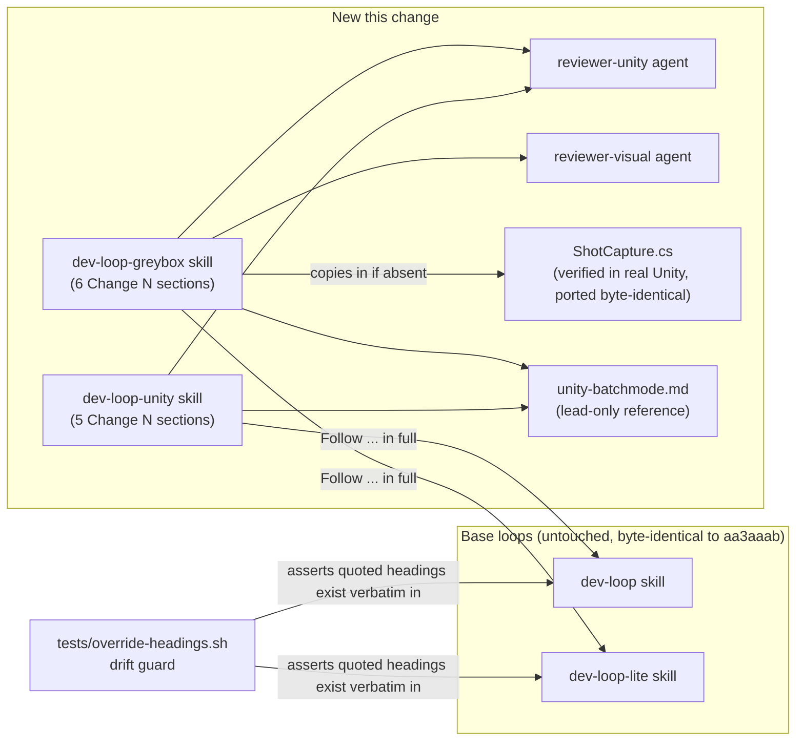
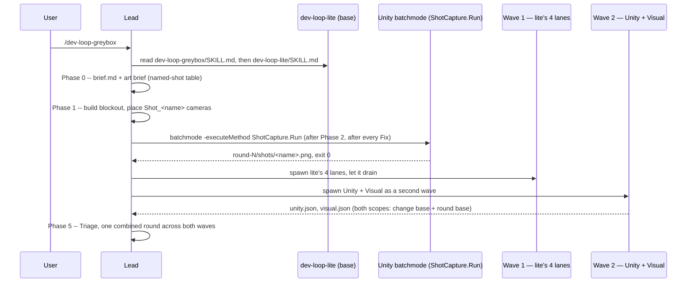

# Walkthrough: porting the Unity dev loops onto the rewritten main

**Branch:** `feat/unity-loops` · **Diff base:** `aa3aaab` · **Change is
uncommitted, working tree** (run `20260927-unity-loops-port`, loop
`dev-loop-lite`). **PR targets `main`** on GitHub. Anchors below are
`path:line` against the working tree, not a commit hash, because nothing has
been committed yet — line numbers will hold once this is staged as-is, but
would drift under further edits.

This is a port, not new work: `dev-loop-unity` and `dev-loop-greybox` were
already built and reviewed once, in run `20260926-unity-dev-loops` on branch
`feat/unity-dev-loops` (commit `0cdd208`). That branch was cut from a `main`
that was a month stale by the time it was ready, and `origin/main` had since
been rewritten (`dev-loop` gained 75 lines, `dev-loop-lite` 30, every reviewer
agent's frontmatter changed) with no shared history — GitHub refused the PR
outright. Rather than force a 64-file conflict resolution across unrelated
trees, the user chose a fresh branch off `aa3aaab` with the Unity files
re-applied and re-reviewed against the new base. The old review's findings
don't transfer for the same reason the branch doesn't: a review is a
statement about a specific diff against a specific base, and the base is
gone.

**Out of scope:** `docs/superpowers/` (the design-spec directory the old
branch used) does not exist on this main and is not recreated; `dev-loops.pdf`
and its booklet are untouched — the Unity loops are deliberately not added to
it (see Decisions); and the old branch's SVG diagram generator
(`docs/diagrams/src/*.py`) is dropped entirely — this main had already
replaced its own diagram pipeline with hand-authored draw.io + quantized PNG
by the time this port started, and the two new diagrams follow that, not the
old branch's approach.

## Architecture

The arrows labelled "Follow ... in full" are an instruction the lead executes
at runtime — read the base `SKILL.md`, then layer the override's `Change N`
sections on top — not a code dependency. Nothing under `dev-loop`/
`dev-loop-lite` references the Unity skills back.

## Sequence — `/dev-loop-greybox` from invocation to the second review wave

## Change table

| File | Change | Notes |
| --- | --- | --- |
| `user/.claude/skills/dev-loop-unity/SKILL.md` | New — five `Change N` sections overriding `dev-loop` | Entrypoint for `/dev-loop-unity` |
| `user/.claude/skills/dev-loop-unity/references/unity-batchmode.md` | New — Editor location, lockfile precondition, the four batchmode commands, no-GPU rule, scratch-worktree `Library/` copy | Shared by both skills; lead-only |
| `user/.claude/skills/dev-loop-unity/references/review-lanes-unity.md` | New — Unity and Visual lane cards | Shared by both skills' Phase 4 |
| `user/.claude/skills/dev-loop-greybox/SKILL.md` | New — six `Change N` sections overriding `dev-loop-lite` | Entrypoint for `/dev-loop-greybox`; see Decisions on Changes 4 and 5 |
| `user/.claude/skills/dev-loop-greybox/references/ShotCapture.cs` | New — batchmode shot renderer, ported byte-identical from the verified reference | See Decisions |
| `user/.claude/agents/reviewer-unity.md` | New — Unity lane, re-derived from the new `reviewer-technical.md`'s scope step | See Decisions |
| `user/.claude/agents/reviewer-visual.md` | New — Visual lane, copied as-is | Never diffs, so nothing to re-derive |
| `tests/override-headings.sh` | New — heading-drift guard plus the `"loop"`-identity check | 18/18 assertions pass, see Tests |
| `README.md` | Loop table gains a Unity row-pair; TOC entry; command examples; a side-note under the loop-selection image; new `## Unity loops` section with both PNG embeds | Mechanical except the side-note wording, see Decisions |
| `docs/diagrams/README.md` | Two table rows; booklet note extended to exclude the Unity loops | Mechanical |
| `docs/diagrams/dev-loop-unity.drawio`, `dev-loop-greybox.drawio` | New — one `.drawio` per skill, main's existing style | See Decisions (compress/expand convention) |
| `docs/diagrams/loop-selection.drawio` | Two new boxes, two new dashed edges | See Decisions — a side-note, not a new decision branch |
| `docs/diagrams/png/*.png` (3, two new + one re-render) | Regenerated via the draw.io CLI and quantized to 128 colours | Matches `docs/diagrams/README.md`'s existing recipe |
| `install.sh`, `install.ps1` | Agent/skill count strings, 22→24 agents, 5→7 loops | Mechanical, matches files on disk |
| `user/CLAUDE.md` | One line pointing Unity repos at the two new loops | Pointer only |

## The flow

| Entrypoint | Trigger | First changed file it reaches |
| --- | --- | --- |
| `/dev-loop-unity` | User types the slash command | `user/.claude/skills/dev-loop-unity/SKILL.md` |
| `/dev-loop-greybox` | User types the slash command | `user/.claude/skills/dev-loop-greybox/SKILL.md` |
| `bash tests/override-headings.sh` | Drift guard, manual or CI | `tests/override-headings.sh` |

This walkthrough follows `/dev-loop-greybox`, the deeper override, and calls
out `/dev-loop-unity` and the test wherever they diverge.

### `dev-loop-greybox/SKILL.md` — "Follow the `dev-loop-lite` skill in full"

`user/.claude/skills/dev-loop-greybox/SKILL.md:12–16` sends the lead to
`dev-loop-lite/SKILL.md` directly; the override is never reimplemented from.
Every delta below is anchored to a base heading quoted verbatim in backticks
— `` `## Phase 0 — Frame the slice` `` and so on
(`dev-loop-greybox/SKILL.md:20`). That quoting is the contract
`tests/override-headings.sh` enforces mechanically — see the Tests section —
and it is the reason this port needed **no heading edits** in either
`SKILL.md` even though the underlying base loops changed substantially
between the two review rounds: `dev-loop` and `dev-loop-lite` kept the same
phase names on `aa3aaab` as they had before, so every quoted heading still
resolves. What *did* need updating is described in Change 4 and Change 5
below — behavioural content that references base *semantics*, not headings.

**Change 1** (`SKILL.md:18–26`) extends `brief.md` with the art brief and
named-shot table; unchanged from the reference.

**Change 2** (`SKILL.md:28–36`) places `Shot_<name>` cameras with the Camera
component disabled but the GameObject active — this is the state
`ShotCapture.cs` depends on; the walkthrough follows that call next.

**Change 3** (`SKILL.md:38–50`) inserts shot capture after Phase 2 and after
every Fix round, with the no-GPU rule inlined at lines 47–50 rather than
referencing an external document (see Decisions — this line was a fix, not a
straight port).

**Change 4** (`SKILL.md:52–85`) adds the Unity and Visual lanes and the
two-wave spawn. **This is where the port had to reason about the new base's
semantics rather than just copy text** — see Decisions.

**Change 5** (`SKILL.md:87–94`) retargets both of `dev-loop-lite`'s exits to
`dev-loop`. **This is the one place the port introduced a defect the
reference branch didn't have** — see Decisions.

### `ShotCapture.cs` — `ShotCapture.Run()`, ported byte-identical

`user/.claude/skills/dev-loop-greybox/references/ShotCapture.cs:17–46` opens
the named scene, finds every `Camera` whose name starts with `Shot_`
(lines 26–27), renders each to a PNG, and exits 1 on a missing arg, zero cameras,
or a duplicate name (lines 22–33). This file is not re-derived in this port —
it is copied verbatim from the version already verified against a real Unity
Editor in the prior run (`0cdd208`), confirmed here with `cmp`, not just
`git diff`. A shell-mediated diff on Windows can silently reintroduce CRLF
and report no difference where a byte-for-byte comparison would catch one.

The verification that makes this file trustworthy predates this PR and is
reused, not repeated: Unity 6000.6.3f1, both Built-in Render Pipeline and
URP 17.6, all three failure paths, and the one line in this file that looks
like defensive boilerplate but isn't — the `.Where(c =>
c.gameObject.scene.IsValid() ...)` filter at `ShotCapture.cs:27`. Removing it
in the verification project produced a third, unwanted PNG from a loaded
prefab asset's own camera; a prefab's cameras have no valid `scene`, so the
filter is what keeps them out of the shot count. A reviewer who hasn't seen
this before will read it as redundant for a single-scene batchmode run — it
isn't, and this is why.

### `unity-batchmode.md` — the no-GPU rule, inlined rather than pointed at

`user/.claude/skills/dev-loop-unity/references/unity-batchmode.md:41–44`
states plainly that shot capture must not use `-nographics`, that a headless
machine without a GPU cannot run it, and that this stops the run rather than
skipping capture or the Visual lane. In the reference branch this same
paragraph read "see the risk note in the design spec" — a pointer into
`docs/superpowers/specs/2026-09-26-unity-dev-loops-design.md`, a file that
only ever existed on the unmerged branch and has no equivalent on this main
(struct-001, round 1, accepted — see Decisions).

### `review-lanes-unity.md` and Change 4 — two more lanes, in two waves, now carrying both scopes

`dev-loop-greybox/SKILL.md:52–85` adds `reviewer-unity` and `reviewer-visual`
as always-applicable lanes and reassigns `.meta`/`.unity`/`.prefab`/`.asset`/
`.asmdef` ownership away from `reviewer-artifacts`. The two-wave split itself
(lite's four lanes drain, then Unity + Visual spawn) is unchanged from the
reference — `dev-loop-lite` still assumes a single batch of four, and
greybox still needs six. **What changed is what each wave receives once
spawned**, because `aa3aaab` added "every lane sees the whole change from
round 2, not just the last round's fixes" to both base loops. Read
`SKILL.md:79–85` in full: the added paragraph states explicitly that the
two-wave split is a batch-size mechanism only, and that *both* waves —
including the bespoke second one greybox invented — get both scopes (the
change base always, the round base from round 2) exactly as `dev-loop-lite`'s
own four lanes do. Without that sentence, the bespoke second wave reads like
a hand-rolled replacement of the base's spawn step, and a reader could
reasonably conclude it was exempt from a rule stated inside a spawn step it
appears to bypass.

`dev-loop-unity/SKILL.md:58–62` carries the same idea in one sentence, since
unity has no wave split to explain: `reviewer-unity` gets both scopes "exactly
as every other lane does," under the same base heading.

## Decisions

### Port, not rebase

- **Decided:** a fresh branch from `origin/main`, with the Unity files
  re-applied and adapted, rather than rebasing `feat/unity-dev-loops`.
- **Why:** the reference is one squashed 64-file commit against history the
  new main doesn't share. A rebase would be a 64-file conflict resolution,
  mostly in README and diagram content that this port drops anyway (the SVG
  generator, the booklet redraw).
- **Alternatives considered:** rebase — rejected for the above. Force-pushing
  over `main` to restore shared history — never on the table.
- **Forced by:** unrelated git histories; GitHub's own refusal to open a PR
  across them confirmed there was no shortcut available.

### `dev-loop-greybox` Change 4 and `dev-loop-unity` Change 4 gain explicit two-scope sentences

- **Decided:** `dev-loop-greybox/SKILL.md:79–85` adds a paragraph stating the
  two-wave split is batch-size only and both waves get both scopes;
  `dev-loop-unity/SKILL.md:58–62` adds one sentence doing the same for its
  single Unity lane.
- **Why:** `aa3aaab` ("Review lanes see the whole change, not just the last
  round's fixes") changed what "applicable" and "scope" mean in both base
  loops. `dev-loop-lite`'s own four lanes get this automatically because
  their spawn step *is* the base's spawn step; greybox's second wave is a
  hand-rolled addition the base doesn't know exists, so nothing in the base
  text extends the new semantics to it by reference.
- **Alternatives considered:** stay silent and rely on the base's "every
  lane" wording covering the second wave implicitly — rejected as
  ambiguous. The base's "every lane" statement is written inside a spawn
  step greybox's own text visibly deviates from (one batch vs. two), so a
  reader has no textual basis for assuming the deviation still inherits the
  rule rather than replacing it.
- **Forced by:** the new base semantics landing in `aa3aaab` after the
  reference branch's design was fixed.

### `reviewer-unity.md` re-derived from the new `reviewer-technical.md`; `reviewer-visual.md` copied as-is

- **Decided:** `reviewer-unity.md:36–50` takes its step 3 (the change-base /
  round-base scope explanation) verbatim from the new `reviewer-technical.md`
  (compare `reviewer-technical.md:33–46` — identical wording apart from the
  lane name and card path). `reviewer-visual.md` was ported with no
  equivalent change.
- **Why:** `aa3aaab`'s only change to the reviewer agents themselves is this
  two-scope language, and it lives in each agent's own numbered procedure,
  not in the skill file it's spawned from — so porting the skill files alone
  would have left every reviewer agent one generation behind the base loops
  they run inside. `reviewer-visual.md` never runs `git diff <base>` at all
  — its whole procedure (`reviewer-visual.md:20–32`) is "read the brief, then
  read PNGs" — so there is no diff-scope step in it to update.
- **Alternatives considered:** add a scopes step to `reviewer-visual.md` for
  symmetry with `reviewer-unity.md` — rejected as inventing a mechanism the
  lane has no use for; it doesn't diff anything, so a change-base/round-base
  distinction would be dead prose.
- **Forced by:** the new agent body shape landing in the same base rewrite
  that touched `dev-loop`/`dev-loop-lite`.

### Round-1 corr-001 — greybox's escalation retarget was half-done, and "stale" was the wrong call against it

- **Decided:** `dev-loop-greybox/SKILL.md:87–94` (Change 5) retargets *both*
  of `dev-loop-lite`'s exits to `dev-loop` — the round-1 Critical escalation
  under `### Escalation to the full loop`, and the Phase 0 pre-flight check
  under `## When this loop is the wrong one` — to `dev-loop-unity` instead.
- **Why:** the first draft of this port (matching the unmerged reference
  branch's own Change 5) retargeted only the round-1 escalation and left the
  pre-flight check pointing at plain `dev-loop`, meaning an out-of-scope
  Unity change caught before work even started would have been sent to a
  loop with no Unity lane at all — the opposite of what Change 5 exists to
  guarantee. The correctness lane's first pass flagged this as `stale`,
  reasoning that the text matched `0cdd208` byte-for-byte. That reasoning is
  wrong on this PR's terms: `0cdd208` was never merged, so there is no prior
  commit on `main` for this text to be stale *against*. The lead reclassified
  it `introduced` and it was fixed.
- **Alternatives considered:** none — once the gap was identified, quoting
  both headings in one `Change N` entry was the only fix that keeps
  `tests/override-headings.sh`'s per-heading grep covering both exits.
- **Forced by:** the test's own limits. `override-headings.sh` asserts that
  every heading an override *quotes* exists in the base — it has no way to
  assert that every heading in the base *needing* a retarget was quoted, so
  this specific class of gap (a real exit left un-retargeted) is invisible to
  automation and depends on a human or reviewer reading the base file's own
  exits side by side with the override's Change N list.
- **Related:** corr-002 (round 1) and corr-003 (round 2) were the same
  reclassification applied to a smaller gap — greybox's artifact-ownership
  addendum and its diagram cells both omitted `.asmdef`, present in unity's
  equivalent addendum and lane card. Both were `stale`-against-`0cdd208`,
  reclassified `introduced`-against-`main`, and fixed.

### `unity-batchmode.md`'s no-GPU rule — inlined, not repointed

- **Decided:** the risk text is now written directly into
  `unity-batchmode.md:41–44` instead of citing a design document.
- **Why:** the reference branch's wording pointed at
  `docs/superpowers/specs/2026-09-26-unity-dev-loops-design.md`, a document
  that is an explicit non-goal of this port and does not exist on this main.
  A dangling citation into a nonexistent file is worse than no citation
  (struct-001, round 1, accepted).
- **Alternatives considered:** finding or writing a replacement document to
  point at — rejected; the actual content needed was one paragraph
  (`git show 0cdd208:...design.md`'s risk note, reworded to stand alone), and
  manufacturing a new spec document just to have something to cite would
  have reintroduced the `docs/superpowers/` non-goal by the back door.
- **Forced by:** the non-goal explicitly excluding `docs/superpowers/`.

### Diagrams follow main's draw.io + PNG convention, not the reference branch's SVG generator

- **Decided:** `docs/diagrams/dev-loop-unity.drawio` and
  `dev-loop-greybox.drawio` are hand-authored `.drawio` files rendered to
  quantized PNG, matching every existing loop diagram on this main.
- **Why:** this main had already moved off the Python SVG-generator pipeline
  the reference branch used (that pipeline exists only on the abandoned
  `feat/unity-dev-loops` branch) by the time this port started. Following the
  reference branch's diagram approach here would have reintroduced tooling
  this repository had already deliberately dropped.
- **Compress/expand convention:** rather than reproduce the base diagram's
  full node-by-node detail, every phase the override does not touch is drawn
  as a single compressed box labelled "(unchanged)" —
  `docs/diagrams/dev-loop-unity.drawio` has one for the post-Phase-4-drain
  step and one for Phase 3; `dev-loop-greybox.drawio` has one for Phase 5 and
  one covering Phase 3/4 jointly — while every phase a `Change N` section
  actually modifies is drawn in full and labelled "— OVERRIDDEN" (seven of
  eight phases in `dev-loop-unity.drawio`, four of six in
  `dev-loop-greybox.drawio`). This keeps each new diagram considerably
  shorter than redrawing the full base loop while still making it visually
  obvious, at a glance, which phases a reviewer actually needs to check
  against the `SKILL.md` text.
- **Alternatives considered:** redraw the base loops in full inside each
  Unity diagram for self-containedness — rejected as needless duplication
  that would also need to stay in sync with the base `.drawio` files forever.

### `loop-selection.drawio` — a side-note, not a new gate

- **Decided:** two new boxes (`uFull`, `uLite`) and two new dashed edges
  (`eUFull`, `eULite`) at `docs/diagrams/loop-selection.drawio:32–35`,
  connected from the existing `full` and `lite` outcome boxes.
- **Why:** the substitution rule ("Unity repo → use the Unity loop instead")
  is not a new branch condition in the decision tree that produces `full` or
  `lite` in the first place — it fires *after* the tree has already decided
  code-vs-blockout, full-vs-lite. Modelling it as free-floating notes
  connected by dashed edges, rather than splicing a new yes/no branch into
  the main chain, adds these two facts without touching any existing box,
  edge, or the tree's shape. `README.md:170–173` states the same thing in
  prose: "Unity repos substitute a loop rather than adding a branch to this
  tree."
- **Alternatives considered:** a new top-of-tree question ("Is this a Unity
  repo?") — rejected; it would restructure a diagram this port was asked to
  edit minimally, for a substitution that applies orthogonally to every
  existing leaf, not to the tree's own logic.
- **Forced by:** the non-goal against redesigning the selection tree, plus
  the practical fact that `pageWidth` (bumped 1560→1980,
  `loop-selection.drawio:4`) is a print-page-break hint only and doesn't
  constrain the `-x` export bounds, so widening the canvas for two
  side-column boxes was free.

### The Unity loops are not in the booklet

- **Decided:** `dev-loops.pdf`/`dev-loops.drawio` are untouched;
  `docs/diagrams/README.md:29–30` extends the existing exclusion note (which
  already excluded the selection and tracker diagrams) to name the two Unity
  loops as well.
- **Why:** the booklet is explicitly "the five loops," a fixed, named set
  that predates this change; the selection and tracker diagrams were already
  excluded from it for the same reason before this PR existed. Adding the
  Unity loops to a booklet whose whole identity is "five" would either grow
  it to seven (breaking the name) or require picking which of the seven
  don't count, an arbitrary distinction the booklet doesn't need to make.
- **Alternatives considered:** none — this was a stated non-goal in the
  brief, not a judgment call made during implementation.

### The short `"loop"` values — `unity`/`greybox`, not the skill name

- **Decided:** `dev-loop-unity/SKILL.md:75–78` writes `"loop":"unity"`, and
  `dev-loop-greybox/SKILL.md:108–112` writes `"loop":"greybox"` — never the
  `dev-loop-`-prefixed skill name.
- **Why:** carried forward from the reference branch's already-settled
  convention: every existing loop's `index.jsonl` entry already uses the
  short form (`full`, `lite`, `ultra`, `ultra-opus`), never the skill name
  with its prefix. `tests/override-headings.sh:23–41` (`check()`'s second
  half) asserts each override declares at least one `"loop"` value distinct
  from its base's set, specifically to catch an override silently inheriting
  the base's value — greybox inheriting `dev-loop-lite`'s `"loop":"lite"` was
  the original defect this check exists to prevent, in the prior run.
- **Not re-litigated this run:** this convention and its regression test
  were already fixed on the reference branch; the port re-applied both
  unchanged rather than re-deriving them.

## Where to look to review this

In priority order:

1. `user/.claude/skills/dev-loop-greybox/SKILL.md:87–94` (Change 5) — the
   escalation retarget covering both exits. This is the one place the port
   introduced a defect that didn't exist on the reference branch; confirm
   both headings are quoted and both point at `dev-loop-unity`.
2. `user/.claude/skills/dev-loop-greybox/SKILL.md:79–85` and
   `user/.claude/skills/dev-loop-unity/SKILL.md:58–62` — the two-scope
   sentences reconciling the bespoke wave/lane mechanics with `aa3aaab`'s new
   base semantics.
3. `user/.claude/agents/reviewer-unity.md:36–50` against
   `user/.claude/agents/reviewer-technical.md:33–46` — confirm the scope
   step matches the new base agent shape, and that `reviewer-visual.md` was
   correctly left without one.
4. `tests/override-headings.sh` (whole file, 47 lines) — run it and confirm
   18/18 assertions pass; try deleting one quoted heading from either base
   `SKILL.md` and rerun to see it fail.
5. `user/.claude/skills/dev-loop-greybox/references/ShotCapture.cs:26–33` —
   confirm the `scene.IsValid()` filter is present (it's load-bearing, not
   defensive) and that the file is untouched from the verified reference.
6. `docs/diagrams/loop-selection.drawio:32–35` — confirm the two new boxes
   read as a side-note (dashed edges from `full`/`lite`) rather than a new
   branch spliced into the existing decision chain.

## Tests

- `bash tests/override-headings.sh` — 18/18 assertions pass (7 quoted
  headings + 1 loop-identity check for `dev-loop-unity`; 9 quoted headings +
  1 loop-identity check for `dev-loop-greybox`, reflecting Change 5's two
  quoted exits).
- `bash tests/install-contract.sh` — passes; agent/skill counts on disk (24
  agents, 7 `dev-loop*` skill directories) match the strings updated in
  `install.sh`/`install.ps1`.
- `ShotCapture.cs` — not re-verified in this run; byte-identity to the
  already-verified reference was confirmed with `cmp` (not `git diff`, which
  can mask a CRLF reintroduction on Windows). The underlying Unity Editor
  verification (6000.6.3f1, Built-in RP and URP 17.6, all three failure
  paths, the `scene.IsValid()` filter proven load-bearing by removing it and
  observing a third unwanted PNG) is carried over from run
  `20260926-unity-dev-loops` and not repeated here, since the file has not
  changed.
- Diagram rendering — both new `.drawio` files and the re-rendered
  `loop-selection.drawio` were rendered with the draw.io CLI
  (`-x -f png -b 20 --width 2000`) and quantized to a 128-colour palette per
  `docs/diagrams/README.md`'s existing recipe; an independent verification
  pass re-rendered all three fresh and found dimensions matched exactly and
  per-pixel differences were consistent with quantization noise (mean
  absolute difference 0.28–0.36, at most 0.001% of pixels differing by more
  than 40).
- **Not covered:** Unity versions other than 6000.6.3f1, and HDRP — untested
  for `ShotCapture.cs`, on the reference branch and here.

## Open questions

Unity versions other than 6000.6.3f1, and HDRP, untested for ShotCapture.
