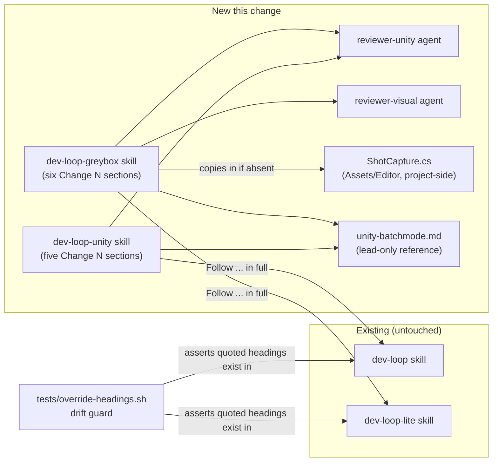
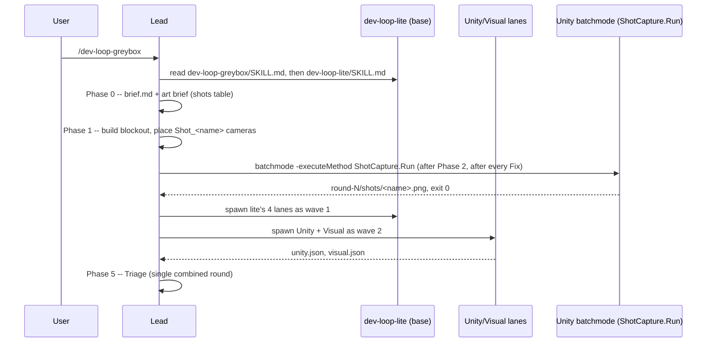

# Walkthrough: Unity dev loops

**Branch:** `feat/unity-dev-loops` · **Diff base:** `b294eb1` · **Change is
uncommitted working tree** (loop `20260926-unity-dev-loops`, `lite`). PR
targets `main` on GitHub.

Two new thin-override loops — `dev-loop-unity` (Unity game code, overrides
`dev-loop`) and `dev-loop-greybox` (in-engine blockouts judged by rendered
shot, overrides `dev-loop-lite`) — plus the agents, batchmode reference, and
tests that make them real. Mid-run, the user asked for the choice diagram and
every existing loop diagram to be redrawn so all nine match, which is why a
second review round exists and why a Python diagram generator is in this
diff at all.

**Out of scope:** `dev-loop`/`dev-loop-lite` themselves — `git diff b294eb1 --
user/.claude/skills/dev-loop user/.claude/skills/dev-loop-lite` is empty, and
that emptiness is a hard constraint, not incidental. Also out of scope: image
generation, Unity MCP, Unity variants of ultralight/ultra/ultra-opus, and
cost-model figures for the two new loops (`README.md:65,67` reads `—` in the
cost column — `docs/cost-model.py` was never touched).

## Architecture

Nothing here reaches into `dev-loop`/`dev-loop-lite`'s files — the arrows
labelled "Follow ... in full" are a phase-by-phase instruction the lead
executes at runtime (read the base `SKILL.md`, then apply the override's
`Change N` sections), not a code dependency the base loops carry back.

## Sequence — `/dev-loop-greybox` from invocation to Fix

## Change table

| File | Change | Notes |
| --- | --- | --- |
| `user/.claude/skills/dev-loop-unity/SKILL.md` | New — five `Change N` sections overriding `dev-loop` | Core skill; see Decisions |
| `user/.claude/skills/dev-loop-unity/references/unity-batchmode.md` | New — Editor location, lockfile precondition, the four batchmode commands, scratch-worktree `Library/` copy | Shared with greybox; lead-only, never read by reviewers |
| `user/.claude/skills/dev-loop-unity/references/review-lanes-unity.md` | New — Unity and Visual lane cards | Shared by both skills' Phase 4 |
| `user/.claude/skills/dev-loop-greybox/SKILL.md` | New — six `Change N` sections overriding `dev-loop-lite` | See Decisions, especially Change 4's two-wave split |
| `user/.claude/skills/dev-loop-greybox/references/ShotCapture.cs` | New — batchmode shot renderer, editor-only | Verified against real Unity, see Decisions |
| `user/.claude/agents/reviewer-unity.md` | New — Unity lane agent, `reviewer-technical.md` frontmatter shape, full `disallowedTools` | Constraint from brief, verified |
| `user/.claude/agents/reviewer-visual.md` | New — Visual lane agent (opus) | Reads only PNGs + brief |
| `tests/override-headings.sh` | New — asserts every backticked base heading an override quotes exists verbatim in the base, and that each override's `"loop":"…"` value is distinct from its base's | See Decisions ("loop" identity) |
| `tests/check-readme-diagram-links.sh` | New — asserts every `docs/diagrams/*.svg` path in `README.md` resolves on disk | Diagram scope-add, round 2 |
| `README.md` | Loop table gains two rows; `<picture>`-embedded SVGs replace the old lone Mermaid choice diagram; new "Each loop, end to end" `
` gallery; new "Unity loops" section; Layout tree agent count 22→24 | Diagram scope-add; see Decisions |
| `docs/diagrams/README.md` | Restructured into "The SVG set" (new) and "The draw.io set" (existing, renamed from the old single section) | Diagram scope-add |
| `docs/diagrams/src/*.py`, `CONVENTIONS.md`, `export.py` | New — layout engine (`_build.py`, also the `dev-loop` slug's own builder), eight `build_<slug>.py` files, `export.py` (HTML→SVG) | Diagram scope-add; round-2 findings fixed here, see Decisions |
| `docs/diagrams/*.svg`, `*.html` (18 files, 9 slugs × light/dark) | New — generated output | Byte-identical reproducibility verified, see Tests |
| `docs/diagrams/dev-loop-flow.svg`/`.html` | New — redraw of the existing `docs/dev-loop-flow.mmd`, not a replacement for it | The `.mmd` is still the source of truth; ignore this pair for logic review |
| `docs/diagrams/*.drawio` (existing five) | Untouched | **Ignore this** — kept alongside the new SVGs, not superseded; see Decisions |
| `install.sh`, `install.ps1` | Agent/skill count strings updated (22→24 agents, "5 loops"→"7 loops") | Mechanical, matches the new files on disk |
| `user/CLAUDE.md` | One line added: "Unity repos: `/dev-loop-unity` for code, `/dev-loop-greybox` for blockouts..." | Pointer only, no loop-table changes |
| `.gitignore` | `__pycache__/` added | The diagram generator creates it on every build; lead added this, not part of a triage item |

## The flow

| Entrypoint | Trigger | First changed file it reaches |
| --- | --- | --- |
| `/dev-loop-unity` | User types the slash command | `user/.claude/skills/dev-loop-unity/SKILL.md` |
| `/dev-loop-greybox` | User types the slash command | `user/.claude/skills/dev-loop-greybox/SKILL.md` |
| `bash tests/override-headings.sh` | Drift guard, CI or manual | `tests/override-headings.sh` |
| README, opened by a reader | Browsing the repo | `README.md` — the loop table and diagram gallery |

This walkthrough follows `/dev-loop-greybox`, the deeper override (six
changes against five for unity, plus the two-wave split and the capture step
neither of the base loops has).

### `dev-loop-greybox/SKILL.md` — "Follow the `dev-loop-lite` skill in full"

`user/.claude/skills/dev-loop-greybox/SKILL.md:12–16` sends the lead to read
`dev-loop-lite/SKILL.md` and work from it directly; the override file is not
a copy and is never reimplemented from. Everything below is one of the six
named deltas, each anchored to a base heading quoted verbatim in backticks —
`` `## Phase 0 — Frame the slice` `` and so on. That quoting is not
decoration: `tests/override-headings.sh` greps for exactly that pattern and
fails the build if a quoted heading doesn't exist in the base file, so a
future rename of a `dev-loop-lite` phase heading breaks this test rather than
silently orphaning the override.

**Change 1** (`SKILL.md:18–26`) extends `brief.md` with an art brief: mood,
scale, palette/lighting intent, and a named-shot table (`Name`, `Camera
position`, `Look target`, `Must show`). Definition of done becomes "compile
check passes and every named shot renders."

**Change 2** (`SKILL.md:28–36`) is where the sidekick brief for Phase 1 gets
its Unity-specific instruction: build the blockout, and for every named shot
place a camera named `Shot_<name>` with **the Camera component disabled but
the GameObject active** — call this out now, because the next section
(`ShotCapture.cs`) depends on that exact state and looks wrong without this
context.

**Change 3** (`SKILL.md:38–50`) inserts capture as a new step after Phase 2
and after every Phase 6 fix round — not a review finding but a
definition-of-done gate: a missing PNG stops the round outright. It also
states the no-GPU rule: a capture failure for lack of a graphics device still
stops the run, and is never a reason to skip the Visual lane. **This is
where the walkthrough follows the call into `ShotCapture.cs`** — read that
next.

### `ShotCapture.cs` — `ShotCapture.Run()`, `Assets/Editor` (project-side, copied in by the sidekick)

`user/.claude/skills/dev-loop-greybox/references/ShotCapture.cs:17–46` is the
batchmode entry point invoked via `-executeMethod ShotCapture.Run`. It opens
the named scene, finds every `Camera` whose name starts with `Shot_`, renders
each to a `Width×Height` (1920×1080, `ShotCapture.cs:14–15`) PNG named after
the camera, and exits 0 on success or 1 on any of three failure paths: a
missing `-scene`/`-shotsOut` arg (`ShotCapture.cs:22–23`, both read through the
`Arg` helper at `:72–76`), no `Shot_*` cameras, or a duplicate name (`:29–33`).

Two lines are easy to misread as bugs and both were checked against a real
Editor, not just reasoned about (see Decisions):

- `Resources.FindObjectsOfTypeAll<Camera>()` at `ShotCapture.cs:26` finds
  cameras **regardless of whether the Camera component is enabled** — that's
  intentional, because Change 2 places shot cameras with the component
  disabled by design (so they don't fight the Editor's own scene view
  camera), and `Render()` at `:57` works on a disabled component as long as
  the GameObject is active.
- The `.Where(c => c.gameObject.scene.IsValid() ...)` filter at
  `ShotCapture.cs:27` looks redundant for a single-scene batchmode run. It
  isn't: a loaded prefab asset (as opposed to a scene instance) has cameras
  too, and `scene.IsValid()` is what keeps a prefab's cameras out of the
  count. Removing it was tried during verification and produced a third,
  unwanted PNG.

### `unity-batchmode.md` — the commands the lead runs, never a reviewer

`user/.claude/skills/dev-loop-unity/references/unity-batchmode.md:1–4` states
plainly that this file is read and executed by the lead directly; reviewers
never touch it. It covers Editor location (`$UNITY_EDITOR`, then
`ProjectSettings/ProjectVersion.txt`, then stop and ask — never guess a
version, `:8–17`), the lockfile precondition before every batchmode
invocation (`:19–25`), the four commands as a table (`:27–36`, including
*Shot capture*, which Change 3 above calls by name), and the rule that
`-runTests` and `-quit` must never be combined (`:38–39`, they race). It
closes with the Tests-lane scratch-worktree instruction to copy `Library/`
before running anything there, because a fresh worktree triggers a full
reimport that can take minutes to hours on a Unity project (`:51–63`).

### `review-lanes-unity.md` and Change 4 — two more lanes, in two waves

`dev-loop-greybox/SKILL.md:52–77` adds `reviewer-unity` and `reviewer-visual`
as always-applicable lanes reading the Unity/Visual sections of
`review-lanes-unity.md`, and reassigns `.meta`/`.unity`/`.prefab`/`.asset`
ownership away from `reviewer-artifacts` to the Unity lane via the same
spawn-prompt addendum `dev-loop-unity` uses. **This is where the round
structure changes from lite's assumption**, and it's worth reading in full
because it isn't obvious from the diff alone — see Decisions.

## Decisions

### Why the two-wave split, when `dev-loop-lite` assumes one batch of four

- **Decided:** `dev-loop-greybox/SKILL.md:73–77` spawns lite's four lanes as
  one batch, lets it drain, then spawns Unity + Visual as a second wave —
  and takes the working-tree snapshot comparison after the second wave
  drains, not the first.
- **Why:** `dev-loop-lite`'s Phase 4 states its four lanes fit in a single
  batch and that there are no waves; greybox always runs six lanes (four lite
  + Unity + Visual, both marked "Always in this loop"), so a batch of six has
  no instruction in the base skill to fall back on (round-1 finding
  `corr-001`, Major, accepted). The smallest fix was a second wave sentence
  in this override, not a general wave-splitting rule added to the base
  loop — that would have put Unity-specific reasoning into a skill every
  non-Unity run also reads, which the base-loops-byte-identical constraint
  and the "seldom used, don't bloat the common skill" framing both rule out.
- **Alternatives considered:** teach `dev-loop-lite` a general N-lane
  batching rule — rejected, exactly the bloat the two-skill design (over a
  shared lane table) was chosen to avoid; run all six lanes in one call
  anyway — rejected because it directly contradicts the base skill's
  explicit "no waves" statement rather than extending it.

### Why the run's `"loop"` value is `"unity"`/`"greybox"`, not the skill name

- **Decided:** `override-headings.sh:23–41` asserts each override's literal
  `"loop":"<value>"` string differs from its base's, and both `SKILL.md`
  files' "Run identity" sections write the short form —
  `dev-loop-unity/SKILL.md:75` is `"loop":"unity"`, not `"dev-loop-unity"`;
  `dev-loop-greybox/SKILL.md:103` is `"loop":"greybox"`.
- **Why:** every existing loop already uses the short form in
  `index.jsonl` — `full`, `lite`, `ultra`, `ultra-opus` — never the skill
  name with its `dev-loop-` prefix. The first draft of `dev-loop-unity`'s Run
  identity section used `"loop":"dev-loop-unity"` (round-1 `struct-001`,
  Major, `missing-required` — greybox's inherited value was the original
  defect: without an override it silently stayed `"loop":"lite"`, making
  greybox runs indistinguishable from lite ones in the shared index). The
  lead adjusted the fix agent's remedy to match the established short-name
  convention instead of introducing a fourth naming scheme.
- **Regression test:** `override-headings.sh` was extended (not written from
  scratch) to assert this — `check()`'s second half (`:23–41`) fails if an
  override's `"loop"` value set is not distinct from its base's, which is
  the failing case the pre-fix `dev-loop-greybox` (silently inheriting
  `"loop":"lite"`) would have tripped.
- **Loop-identity check is existence, not universality:** the check accepts
  an override that names *at least one* distinct `"loop"` value — it does
  not demand every `"loop"` string in the override differ from the base's,
  because `dev-loop-lite/SKILL.md` legitimately quotes `"loop":"full"` for
  contrast when describing escalation, and a stricter check would forbid
  that legitimate cross-reference.

### Why `ShotCapture.cs` ships with a plain `camera.Render()` and no render-pipeline branch

- **Decided:** `ShotCapture.cs:57` calls `camera.Render()` unconditionally,
  no `RenderPipeline.SubmitRenderRequest` branch for URP.
- **Why:** verified directly in two scratch Unity 6000.6.3f1 projects, one
  Built-in Render Pipeline and one URP 17.6.0 — both exited 0, both wrote
  1920×1080 PNGs with the scene visibly lit, and both rendered a camera whose
  Camera component was disabled while its GameObject stayed active (the
  exact state Change 2 places shot cameras in). All three failure paths
  (duplicate camera name, zero cameras, missing `-shotsOut`) exited 1 with
  the stated messages in both projects. This is real Editor evidence, not
  documentation-only reasoning — the definition of done in the brief named
  this exact matrix.
- **The `scene.IsValid()` filter is proven load-bearing, not defensive
  boilerplate:** with a prefab asset loaded alongside the scene, the guard
  keeps output at 2 PNGs; removing it in the same test project produced a
  third, unwanted `Prefab.png`. Left in without that check, this line would
  have looked like unreachable caution to a reviewer who hadn't tried
  removing it.
- **Alternatives considered:** `RenderPipeline.SubmitRenderRequest` for URP
  compatibility — rejected on no evidence of need once `Render()` was shown
  to work under both pipelines tested.
- **Untested, stated plainly:** only Unity 6000.6.3f1 was used; other Unity
  versions and HDRP are unverified (carried to Open questions).
- **Side finding, not acted on:** Unity's prefab importer forces a prefab
  *root's* name to the file name, so a `Shot_` camera must be a child object
  inside a prefab to keep its name — relevant only to how the verification
  scratch project was built, not added to any skill content, since no skill
  here creates prefabs.

### Why the diagrams are in this diff at all, and why round 2 exists

- **Decided:** the user asked mid-run (after Phase 0 had already scoped
  diagrams as a non-goal) to draw the two new Unity loops and redraw every
  existing loop diagram "so they all match," plus embed all nine in the
  README. This was treated as a scope change, not an escalation — it adds no
  risk surface (docs/SVG only, nothing executable in the loop skills
  themselves) — so the run stayed on `dev-loop-lite`, and round 2 exists
  specifically to review the diagrams round 1 predates.
- **Why generated rather than hand-drawn, and why one pilot before fan-out:**
  nine diagrams needing one shared visual grammar is exactly the case where
  independent hand-authoring drifts — three sidekicks each settle their own
  spacing and type ramp. One sidekick built `dev-loop` first and wrote
  `docs/diagrams/src/_build.py` (the shared `Layout` engine and tokens, which
  also directly contains the `dev-loop` slug's own build function —
  `_build.py` is both infrastructure and one of the nine builders,
  `docs/diagrams/README.md:36–40`) plus `CONVENTIONS.md`; eight more
  sidekicks then each wrote one `build_<slug>.py` importing only from
  `_build`, copying that grammar rather than inventing their own.
- **Why SVG, committed, not regenerated on demand:** each is 16–31 KB pure
  vector with no raster fallback — negligible to commit — versus the
  existing draw.io set's PNGs, which run over a megabyte each at readable
  width and are deliberately not committed for that reason
  (`docs/diagrams/README.md:107–112`). Reproducibility was verified: building
  from a scratch copy of `src/` and exporting reproduces the committed SVGs
  byte-identical (modulo CRLF/LF), so the generator, not hand-touched output,
  is the actual source of truth.
- **Why system fonts and a light/dark `<picture>` pair per diagram:** GitHub
  renders README images through a bare `` tag, which cannot fetch web
  fonts — a diagram styled with a custom typeface would silently fall back
  to whatever the viewer's browser substitutes. The `github` diagram-design
  profile (`.diagram-design` at repo root, profile docs at
  `~/.diagram-design/profiles/github.md`) uses GitHub's own system-font
  stacks instead. Every diagram ships as a light/dark SVG pair wired through
  `<picture>`/`prefers-color-scheme`, the mechanism GitHub actually uses to
  serve per-theme images: the choice diagram at `README.md:78`, the "Each
  loop, end to end" gallery starting at `README.md:85`, and the same pairing
  described in `docs/diagrams/README.md:3–6`.
- **Why the draw.io files stay:** they're the detailed, editable set for the
  original five loops and predate the Unity loops; nothing in this change
  supersedes them, so they're kept alongside the new generated SVGs rather
  than replaced (`docs/diagrams/README.md:67–68` states plainly that
  `dev-loop-unity`/`dev-loop-greybox` have no draw.io version — that gap is
  intentional, not an oversight).
- **Round-2 findings, all mechanical and behaviour-preserving:** 23 lines
  over the 120-character coding-standards limit in `docs/diagrams/src`
  (fixed — line count now zero, confirmed by rerunning the same check); a
  duplicate shadowed `esc()` in `_build.py` deleted; an unused
  `anchors_bottom` variable deleted; unused imports across five build files
  deleted; and lite's build script's ~85-line copy of `render()` for one
  legend label replaced with the targeted override the sibling files already
  used (inferred evidence, Minor, accepted because the remedy is local and
  verified byte-identical). The lead separately caught `export.py`'s
  docstring embedding a local Windows path (`C:\Users\vanzy\...`) and had it
  replaced with `~/.diagram-design/profiles/github.md` — a security-adjacent
  finding raised below any lane's threshold, fixed directly. Every fix in
  this round was verified by regenerating and diffing against the previously
  committed SVG/HTML — none were expected to change pixels, and none did.
- **Alternatives considered for the diagram set as a whole:** hand-authored
  SVG per diagram — rejected, drifts across nine files with no shared
  source; HTML-only, no SVG — rejected, GitHub cannot embed raw HTML in a
  README; PNG — rejected, large and theme-blind, the exact problem the
  existing draw.io PNGs already demonstrate in this repo
  (`docs/diagrams/README.md:107–112`).

## Where to look to review this

In priority order:

1. `user/.claude/skills/dev-loop-greybox/SKILL.md:73–77` and
   `user/.claude/skills/dev-loop-unity/SKILL.md:58–59` — the two-wave split
   and the "counts toward the four-at-a-time wave limit" line. This is the
   one place the override changes round *mechanics*, not just content.
2. `user/.claude/skills/dev-loop-greybox/references/ShotCapture.cs:26–33` —
   the `Resources.FindObjectsOfTypeAll` filter and the two failure guards.
   Confirm the `scene.IsValid()` clause is still present; it is proven
   load-bearing, not defensive (see Decisions).
3. `tests/override-headings.sh` (whole file) — run it and confirm 17/17
   assertions pass, then try deleting one quoted heading from either base
   skill and rerun to see it fail, per the brief's definition of done.
4. `user/.claude/skills/dev-loop-unity/SKILL.md:72–75` and
   `dev-loop-greybox/SKILL.md:100–104` — the `"loop"` value convention; cross-
   check against `.claude/review/runs/index.jsonl`'s existing entries to
   confirm `unity`/`greybox` match the short-name pattern already in use.
5. `docs/diagrams/src/_build.py`, `CONVENTIONS.md` — the shared engine and
   its stated grammar; spot-check one `build_<slug>.py` against it rather
   than reading all nine.
6. `README.md:65–160` — the new loop-table rows and diagram gallery; confirm
   the cost column reads `—` for both new loops. Then `README.md:175–187` —
   the "Unity loops" section — confirm it states the Editor-closed /
   lockfile precondition.

## Tests

- `bash tests/override-headings.sh` — 17/17 assertions pass (7 quoted
  headings + 1 loop-identity check for `dev-loop-unity`; 8 quoted headings +
  1 loop-identity check for `dev-loop-greybox`). Demonstrated failing per the
  brief's definition of done by removing a quoted heading and rerunning.
- `bash tests/check-readme-diagram-links.sh` — 17/17 SVG paths referenced
  from `README.md` resolve on disk.
- `bash tests/install-contract.sh` — passes (agent/skill counts updated to
  match the new files).
- `ShotCapture.cs` — verified out-of-band against a real Unity 6000.6.3f1
  Editor (reviewers cannot run Unity): success path (2 PNGs, 1920×1080,
  scene visible, including a disabled-component/active-GameObject camera)
  under both Built-in RP and URP 17.6.0, and all three failure paths
  (duplicate name, no cameras, missing arg) exiting 1 with the stated
  messages, in both render-pipeline projects.
- Diagram reproducibility — building every `build_<slug>.py` from a scratch
  copy of `src/` and exporting reproduces all 18 committed `.svg` files and
  their 18 `.html` viewer pages byte-identical modulo CRLF/LF.
- **Not covered:** the PowerShell half of the installer count strings
  (`install.ps1`) was checked by inspection, not executed — this repo's test
  suite is bash-only and there's no PowerShell equivalent of
  `install-contract.sh` for this change specifically. Unity versions other
  than 6000.6.3f1 and HDRP are untested (see Open questions).

## Open questions

Camera.Render() works under both Built-in RP and URP in batchmode on
6000.6.3f1. Other Unity versions / HDRP untested.
