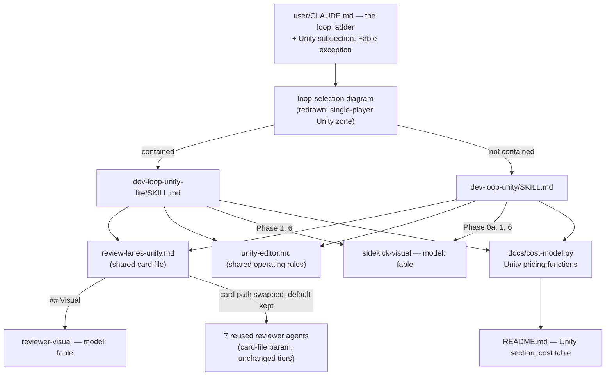

# Walkthrough: two dev loops for single-player Unity work

**Branch:** `feat/unity-game-loops` · **Diff base:** `aa3aaab` (working tree
uncommitted at review time — no PR opened yet, this walkthrough lands before
it is raised)

This adds `dev-loop-unity` and `dev-loop-unity-lite`, two more entries beside
the five general loops, built from what a same-brief comparison run of a
full-loop pass against a single Fable pass on single-player Unity work
taught: Fable was markedly better at art direction, framing, reading as a
game, and visual self-QA, at a fraction of the tokens; the general loop was
markedly better at correctness an image cannot show — unsaved settings,
tests overwriting production assets, measured placement — and at discipline
over shared project settings. Both loops fold that lesson in: Fable owns the
Visual lane and its sidekick, nowhere else; the code lanes stay on their
usual tiers; Security drops out because an eligible change cannot reach it;
and four structural review concerns fold into one lane that only runs once.
The five existing loops are also redrawn (`diagram-design` skill, new
default skin) alongside the two new ones and the loop-selection diagram.

**Out of scope:** no behavioural change to the five existing loops — only
their diagrams changed, and only because the skill asked for a full-repo
redraw once it touched diagram-design at all. No Unity C# ships here: the
capture harness and placement primitives are a contract the loops describe,
not code this change writes. The two tracker-skill diagrams
(`backlog-refinement`, `implement-sprint`) are untouched.

## Architecture — where the two loops sit



`sidekick-visual` and `reviewer-visual` are the only two agents in the
repository pinned to Fable — everything else in the diagram, including the
seven reused reviewers, runs at its existing tier untouched.

## Sequence — a `dev-loop-unity` run

```mermaid
sequenceDiagram
    participant Lead
    participant SV as sidekick-visual (fable)
    participant S as sidekick
    participant SL as sidekick-lite
    participant RV as reviewer-visual (fable)
    participant R as reused reviewers
    participant Verify as reviewer-verify

    Lead->>Lead: Phase 0 — frame, verify editor, list named shots + what each must show
    Lead->>SV: Phase 0a — scene bible (visual scope only)
    Lead->>S: Phase 0b — asset inventory, placement primitives, capture harness
    Lead->>S: Phase 1 — code and systems
    Lead->>SV: Phase 1 — scene build, look at every capture, ≤2 self-QA passes
    Lead->>SL: Phase 3 — run harness into round-N/captures, snapshot
    par Wave 1 (≤4 lanes)
        Lead->>RV: Visual (gated: renders changed)
        Lead->>R: Requirements (always) / Technical, Tests (gated: C# changed)
    and Wave 2
        Lead->>R: Artifacts (gated) / Structure (round 1 only)
    end
    Lead->>Lead: Phase 5 — triage; recurring-concern rule if a Visual finding repeats round 2
    Lead->>S: Phase 6 — fix, test-before-fix
    Lead->>SV: Phase 6 — visual fix, recapture, confirm by eye
    Note over Lead: Round 2 reruns the gated lanes only; Structure does not rerun
    Lead->>RV: Phase 7 — visual confirmation only (no new findings, no loop)
    Lead->>Verify: Phase 8 — verify (Critical fixed, Artifacts ran, or visual unconfirmed)
    Lead->>Lead: Phase 8b walkthrough, Phase 9 ship
```

## Change table

| File | Change | Notes |
| --- | --- | --- |
| `user/.claude/skills/dev-loop-unity/SKILL.md` | New — the full loop | Entrypoint once routed |
| `user/.claude/skills/dev-loop-unity-lite/SKILL.md` | New — the contained loop | |
| `user/.claude/skills/dev-loop-unity/references/review-lanes-unity.md` | New — shared card file, 7 cards | |
| `user/.claude/skills/dev-loop-unity/references/unity-editor.md` | New — shared editor/scene operating rules | |
| `user/.claude/agents/sidekick-visual.md` | New — Fable implementation agent | |
| `user/.claude/agents/reviewer-visual.md` | New — Fable Visual lane | |
| `user/.claude/agents/reviewer-requirements.md`, `reviewer-technical.md`, `reviewer-tests.md`, `reviewer-artifacts.md`, `reviewer-lite-correctness.md`, `reviewer-lite-structure.md`, `reviewer-lite-tests.md` | Step 1 reads its card from a lead-named file, default unchanged | Card-file indirection, one line each |
| `user/CLAUDE.md` | New "Unity game development" subsection; Fable exception stated in delegation policy | |
| `README.md` | Skill/agent counts, loops table, Unity section, cost table + like-for-like framing | |
| `INSTALL.md`, `install.sh`, `install.ps1` | Agent/skill counts and dry-run text updated | Mechanical, follows from the new files |
| `docs/cost-model.py` | Adds `fable` pricing and the two Unity loop cost functions | |
| `docs/diagrams/*.drawio` (6, deleted: 5 redrawn loops + loop-selection) | Superseded by the HTML diagrams below | Redraw, not a Unity feature |
| `docs/diagrams/dev-loops.drawio` (deleted) | Booklet source folded into `export.py --booklet` | |
| `docs/diagrams/*.html` (8, new: 5 redrawn loops + loop-selection + 2 Unity loops) | The `diagram-design` redraw | |
| `docs/diagrams/png/*.png` (8: 6 redrawn + 2 new) | Regenerated from the HTML | **Ignore individually** — reviewed as images, not diffed |
| `docs/diagrams/dev-loops.pdf` | Regenerated booklet, now 7 pages | |
| `docs/diagrams/export.py` | New — headless-Chrome PNG and booklet export | Replaces the draw.io CLI + Pillow PDF path for these 7 diagrams |
| `docs/diagrams/README.md` | Rewritten for the HTML/export.py pipeline | |

## The flow

| Entrypoint | Trigger | First changed file it reaches |
| --- | --- | --- |
| Routing a change | The lead reads the ladder before starting any loop | `user/CLAUDE.md:72` (new Unity subsection) |

1. **`user/CLAUDE.md:72-91`** states the two loops' eligibility (single-player,
   none of networking/accounts/purchases/analytics/UGC/mods/credentials) and
   their escalation. This is prose, not code, but it is where a change is
   routed to the Unity loops at all — the redrawn `loop-selection.png`
   visualizes the same decision as a "single-player Unity" zone branching off
   the ladder's first diamond, next to the existing five.
2. Once routed, `dev-loop-unity/SKILL.md:70-108` (or the lite skill's Phase
   0/1) runs Phase 0 (frame, editor check, capture-level acceptance), then
   Phase 0a — **only when the change has visual scope** — hands
   `sidekick-visual` the references, the design doc and the existing
   inventory to write `.claude/unity/scene-bible.md`
   (`SKILL.md:81-91`), then Phase 0b has `sidekick` build the asset
   inventory, placement primitives and capture harness
   (`SKILL.md:93-108`) that every later phase places through.
3. Phase 1 (`SKILL.md:110-117`) routes by kind: code and systems to
   `sidekick`, scene work to `sidekick-visual`, which must look at every
   capture it makes before calling anything done.
4. Phase 3 (`SKILL.md:126-147`) is where review starts: the lane table gates
   Visual on anything render-affecting or a named shot, Technical/Tests on
   changed C#, Artifacts on a settings/pipeline/package/`.meta` change, and
   Structure to round 1 only. This gating — not the existence of the lanes —
   is most of the loop's economy; see Decisions below.
5. Phase 5 triage (`SKILL.md:157-163`) carries the **recurring-concern
   rule**: a Visual finding raised in round 1 and again in round 2 is not
   patched in the scene a second time — the fix becomes a shared primitive,
   with a regression test.
6. Phase 7 (`SKILL.md:171-177`) runs a **visual confirmation** after round
   2's fixes if any accepted finding was visual: recapture, rerun only the
   Visual lane, ask only whether each fix now shows fixed. It raises nothing
   new — a failure there is reported, not looped, because there is no round
   3 in either Unity loop.

## Decisions

### Two loops, not gating on one (`dev-loop-unity/SKILL.md`, `dev-loop-unity-lite/SKILL.md`)

- **Decided:** mirror the general ladder's lite/full split rather than one
  loop with internal gating.
- **Why:** most single-player changes are contained and should not pay for
  Phase 0a art direction or a six-lane review; a single gated loop cannot
  skip those framing costs the way a whole missing loop can.
- **Alternatives considered:** splitting by kind instead — a "visual" loop
  and a "code" loop — rejected because real Unity changes mix both, and the
  Visual lane's own gate (renders changed, or named shots) already separates
  them per-change without forcing the split at the loop level.
- **Forced by:** nothing named in the brief — a free choice, made the same
  way the general ladder already makes it.

### Fable confined to exactly two agents (`sidekick-visual.md`, `reviewer-visual.md`)

- **Decided:** `sidekick-visual` (art direction, visual build, visual fix)
  and `reviewer-visual` (the Visual lane) are pinned `model: fable`
  (`sidekick-visual.md:10`, `reviewer-visual.md:10`); `user/CLAUDE.md:149`
  keeps "do not route to Fable" and states the exception at `:151-154`.
- **Why:** the comparison run's advantage for Fable was concentrated in
  looking at its own captures while building and reviewing, not in a longer
  reasoning chain — a lesson that only transfers to the two roles that
  actually see images.
- **Alternatives considered:** Fable for art direction only, with `sidekick`
  building from the bible it wrote — rejected, because the advantage came
  from Fable seeing its own captures mid-build, which a bible handed to a
  different model cannot carry forward. Opus for the Visual lane was kept
  only as `reviewer-visual`'s stated fallback if Fable fails to return usable
  findings (`reviewer-visual.md:84-86`), not as the default.
- **Forced by:** the instruction to incorporate Fable specifically for
  visual work, and the separate constraint that the exception stay confined
  to two named agents.

### `reviewer-visual` runs at `effort: high`, not `xhigh`

- **Decided:** `reviewer-visual.md:11` sets `effort: high`, where the other
  Opus-tier full-loop reviewers this agent's template is closest to
  (`reviewer-technical.md`) run `xhigh`.
- **Why:** Fable already prices roughly double Opus per token
  (`docs/cost-model.py:15-21`); stacking the heaviest reasoning tier on top
  would make this the single most expensive reviewer in the repository,
  against the loop's own economy requirement. The comparison run's visual
  judgment came from looking at captures, not from a long reasoning chain.
- **Alternatives considered:** `xhigh` (the template default) — rejected on
  cost; `medium` — rejected because this lane is the sole owner of visual
  quality and has no second pass to catch what it misses.
- **Forced by:** the brief's "economical without a noticeable quality loss"
  requirement.

### Card-file indirection in the seven reused reviewers

- **Decided:** each reused reviewer's step 1 now reads its card from "the
  lane cards file the lead names (default `references/review-lanes.md` or
  `review-lanes-lite.md`)" instead of a hard-coded path — for example
  `reviewer-lite-correctness.md:38-40`.
- **Why:** this is the whole reuse mechanism. `review-lanes-unity.md` adds
  Unity-specific ownership language (Technical's lifecycle defects, Tests'
  scratch-editor rule, Artifacts' `.meta`/GUID scope, Structure's
  MonoBehaviour god-object clause) to the *same* three-part card shape the
  general loops use, so the Unity skills can hand a reviewer a different
  file by name and get correct behaviour with no new agent.
- **Alternatives considered:** a template placeholder like `{{cards_file}}`
  — rejected, no agent file in this repository uses template syntax, and
  introducing one here for a single caller would be a new convention for one
  use. New Unity-specific reviewer agents per lane were the brief's explicit
  non-preference (duplication) and were not attempted.
- **Forced by:** the brief's reuse constraint — "add new agents only for new
  roles."

### Review economy: Security dropped, four lanes fold into one round-1-only Structure lane

- **Decided:** no Security card exists in `review-lanes-unity.md` (stated
  explicitly at line 12-15); Architecture, Standards, Dead code and
  Minimalism become one `Structure` card (`review-lanes-unity.md:103-124`),
  run only in round 1, skipped for a recorded throwaway tooling path.
- **Why:** the eligibility list itself makes Security's surface
  unreachable — no networking, accounts, purchases, or credentials means
  nothing for that lane to own. The comparison run found the four structural
  concerns produced real catches but mostly churned standards findings on
  image-producing tooling by round 2; a second pass added nothing.
- **Alternatives considered:** keeping nine gated lanes as the general loop
  does — rejected on cost, since single-player elimination of Security and
  the structural churn were the two concrete places the comparison run
  showed room. Dropping Requirements too — rejected, because in that run it
  is what caught missing scenes and an unjustified settings change; three
  review rounds instead of two — rejected, yield fell off after round two.
- **Forced by:** the brief's explicit "drop review concerns that do not
  apply to single-player games" and its economy requirement.
- **Round-1-only lives in the skill, not the card:** `review-lanes-unity.md`
  states only what Structure skips (line 105-107); the *timing* — that it
  runs round 1 only — sits in each skill's lane table
  (`dev-loop-unity/SKILL.md:147`, `dev-loop-unity-lite/SKILL.md:102`)
  because the existing card convention across every loop describes
  ownership, never phase scheduling, and mixing the two into one file would
  break that convention for a single new card.

### The economics, stated like-for-like (`README.md:371-397`, `docs/cost-model.py:121-218`)

- **Decided:** print Unity review cost with and without the Visual lane
  (`README.md:388-390`: 0.48/1.26 review-only vs full's 2.48, 1.33/2.62 with
  Visual added), and say plainly that the totals are not a like-for-like
  saving because `Impl` prices Fable scene building (the Phase 0a bible, the
  Phase 1 visual build) that the general loops never price at all.
- **Why:** a round-1 finding (`round-1/triage.md` corr-003) caught the first
  draft comparing Unity's *total* — which includes that Fable-priced
  building — against a full-loop total that includes no visual building, and
  calling Unity review "close to full" when its review-only figure is
  actually *above* full's. That comparison made the loop look expensive for
  the wrong reason and hid the real saving, which is in review composition
  (no Security, one Structure pass, gating), not in total price.
- **Alternatives considered:** none for the fix itself — once the
  inconsistency was named, stating both figures and the caveat was the only
  honest option; the only choice left was prose versus a bulleted list, and
  prose was shorter here.
- **Forced by:** the triage decision on corr-003; see round-1/triage.md.
- **A related, adjacent fix:** the cost model itself gated Visual and
  Technical while both skills' lane tables said "always" for Technical/Tests
  and "round 1 always" for Visual (corr-001). The skills were the ones off
  the brief — gating is where the economy mostly lives — so the skills were
  fixed to match the brief's stated gates, not the cost model relaxed to
  match the skills.

### Diagrams: default skin, one faithful swimlane per loop, PNG and booklet by headless Chrome

- **Decided:** every loop diagram, old and new, is redrawn with
  `diagram-design`'s default skin as one faithful swimlane diagram per loop
  (`docs/diagrams/README.md:9-18`), loop-selection as a flowchart
  (`png/loop-selection.png`), with a single coral accent per diagram marking
  its defining feature — the two Fable steps and the Visual lane, for the
  Unity diagrams (`png/dev-loop-unity.png`: the Bible and Visual-build boxes
  and the Visual lane chip are the only coral elements).
- **Why:** these were the repository owner's answers when
  `diagram-design`'s style-guide gate asked — default skin over matching the
  old draw.io colour vocabulary (which the owner said fights the skin's
  one-accent rule), and one diagram per loop over an overview-plus-detail
  pair (twice the files for no stated benefit). Swimlane fits because each
  loop is a cross-functional process whose meaning is who acts — lead,
  sidekicks, reviewers — which a swimlane's rows show directly.
- **Alternatives considered:** the two rejected above were the owner's own
  choices among options put to them, not a unilateral call.
- **Forced by:** the owner's answers at the skill's style-guide gate, once
  the brief asked for the redraw to use `diagram-design`.
- **Export by headless Chrome, not the tools the skill or a prior brief
  named:** `export.py` extracts each diagram's first `<svg>` and screenshots
  it at 2x, then quantizes to 128 colours as the repository already did
  (`docs/diagrams/export.py:38-57`). `diagram-design`'s stated export path
  needs Playwright, not installed on this machine; a housekeeping brief for
  the booklet separately called for Pillow, but this Pillow build has no
  JPEG encoder for RGB and writes uncompressed pages for palette images —
  70MB versus the 1.2MB headless Chrome produces printing the PNGs one per
  A4 page. Both substitutions keep the stated *result* (quantized PNGs, a
  compressed booklet) while changing the *tool* to one already on the
  machine.
- **Round-2 diagram fixes:** the Unity diagrams' loop-back arrows start at
  Fix and route around the outside of the lane grid rather than from the
  Round-cap box, because dev-loop.png's existing precedent starts loop-backs
  at Fix and the Unity lane grid has no interior corridor a connector could
  cross without passing behind a non-endpoint box. Review chips show
  `model · effort` in place of the agent's name, matching dev-loop.png,
  after agent name plus tier cascaded into overflow at four lines per chip.

## Where to look to review this

In priority order:

1. `user/.claude/skills/dev-loop-unity/references/review-lanes-unity.md:103-124`
   — the Structure card's round-1-only and recurring-concern boundary, and
   `SKILL.md:157-163` for where that boundary is enforced in triage. This is
   where "consolidate four lanes into one" could quietly become "drop them."
2. `user/.claude/agents/sidekick-visual.md` and `reviewer-visual.md` in full
   — confirm the Fable exception really is confined to these two files, and
   that `sidekick-visual.md` preloads `coding-standards`/`solution-architecture`
   (`sidekick-visual.md:12-14`) the same as every other implementation agent;
   `reviewer-visual.md` carries no such field, matching every other reviewer
   agent in the repository.
3. `docs/cost-model.py:121-218` against `README.md:383-397` — confirm the
   printed Unity totals actually come from this script's output, and that
   the review-with/without-Visual split is computed, not hand-typed.
4. `user/.claude/agents/reviewer-lite-correctness.md:38-40` as the
   representative of all seven card-path edits — confirm the default path
   is unchanged, so the five existing loops are provably unaffected.
5. `docs/diagrams/png/dev-loop-unity.png` and `png/loop-selection.png` —
   visual check that the coral accent lands only on the Fable-owned boxes
   and the new Unity zone, and that the loop-back and reviewer-tier fixes
   from round 2 (see Decisions) are present.

## Tests

There is no application code here to unit-test — the change is markdown
skills, agent frontmatter, an installer, a cost script, and diagrams — so
"tests" means the checks the definition of done names, all re-run on the
final tree per `verification.md`:

- `tests/install-contract.sh`: 16/16 passing.
- `python docs/cost-model.py`: output matches every Unity figure printed in
  `README.md` (1.33, 2.62, 0.48, 1.26, 6.26, 9.76, 1.10×, 1.71×).
- The diagram self-check and geometry-verification scripts: 0 findings
  across all 8 HTML diagrams.
- A case-insensitive grep for place/project/vendor names across all 29
  changed or added text files against `aa3aaab`: 0 matches. This re-run
  closed a gap — the same check had only been recorded once, in round 1,
  before the diagrams and `export.py` existed.

Not covered, and not coverable by a script: whether the two skill documents'
prose is internally consistent and matches the agents/cards they describe.
That is what the review lanes (Requirements, Structure) checked instead, in
round 1 and round 2 of this run's own review.

## Open questions

Whether `model: fable` in agent frontmatter is accepted by every Claude Code
version the user runs; the Agent tool lists `fable` as a model value, so it
is assumed.
