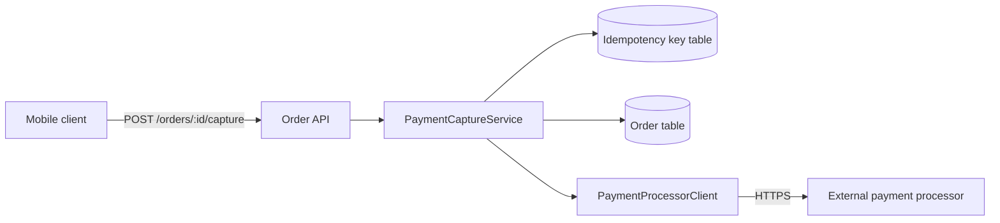
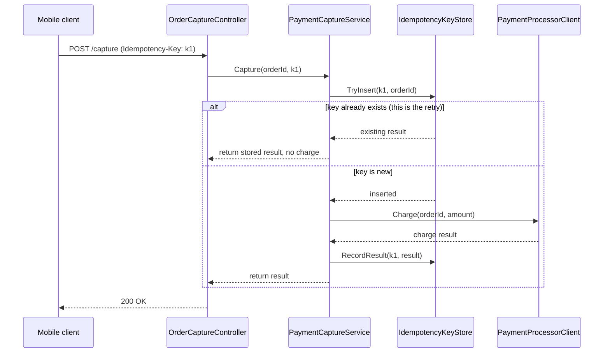

# Walkthrough: idempotent payment capture retries

**Branch:** `fix/capture-retry-double-charge` · **PR:** #482 · **Commit:** `a1c7f3e`

A customer's card was charged twice when a capture request timed out and the
mobile client retried it. The retry reached the payment processor as a brand
new charge because nothing on our side remembered the first attempt had
already gone out. This change makes capture idempotent: a retried request
with the same key returns the original result instead of charging again.

**Out of scope:** refund and void flows have the identical race and are not
touched here — they go through a different handler and get their own story.
Do not read this as "the payment flow is now idempotent"; only capture is.

## Architecture

`PaymentCaptureService` is the only new dependency in the request path — it
now owns the idempotency check before it owns the charge decision, where
previously the charge decision came first.

## Sequence — a retried capture request

## Change table

| File | Change | Notes |
| --- | --- | --- |
| `src/Orders/OrderCaptureController.cs` | Reads and forwards the `Idempotency-Key` header | Entrypoint |
| `src/Orders/PaymentCaptureService.cs` | New idempotency check before the charge call | Core of this change |
| `src/Orders/IdempotencyKeyStore.cs` | New — atomic insert-or-fetch against the key table | New repository |
| `src/Orders/PaymentProcessorClient.cs` | Reclassified timeout as retryable-safe instead of unknown | Small, see Decisions |
| `migrations/2026081701_add_idempotency_keys.sql` | New table, unique index on `(idempotency_key)` | |
| `src/Orders/OrderCaptureController.Tests.cs` | New tests for retry, concurrent retry, missing header | |
| `src/Common/Logging/RequestLogger.cs` | Whitespace only, an editor reformatted an adjacent line | **Ignore this** — unrelated to the fix |

## The flow

1. `OrderCaptureController.Capture` (entrypoint) reads the `Idempotency-Key`
   header. If it is absent, the request is treated as non-idempotent and
   behaves exactly as before — this is a deliberate compatibility choice, see
   Decisions below.
2. `PaymentCaptureService.Capture` calls `IdempotencyKeyStore.TryInsert`
   first, before doing anything that talks to money. This ordering is the
   entire fix: whichever request wins the insert race is the one that gets to
   charge.
3. If the insert reports the key already existed, the service returns the
   previously stored result and never calls `PaymentProcessorClient`.
4. If the insert succeeded, the service proceeds to charge, then writes the
   result back onto the same row.

## Decisions

### `IdempotencyKeyStore` — a table, not the existing Redis cache

- **Decided:** a new relational table (`idempotency_keys`) with a unique
  index on the key, rather than the Redis cache the rest of the service uses
  for hot-path lookups.
- **Why:** the whole point of this change is that a key must never be
  forgotten while a retry is still possible.
- **Alternatives considered:** Redis was the obvious first choice — it is
  already wired in and would have been a smaller diff. It was rejected
  because our Redis tier evicts under memory pressure, and an evicted key is
  indistinguishable from a key that was never set. A silently evicted key
  reopens exactly the double-charge bug this change exists to close; a slower,
  durable store that cannot forget was worth more than the smaller diff.
- **Forced by:** the correctness requirement, not performance — capture is
  not a hot path.

### `IdempotencyKeyStore.TryInsert` — one atomic statement, not check-then-insert

- **Decided:** `IdempotencyKeyStore.TryInsert` uses a single
  `INSERT ... ON CONFLICT DO NOTHING RETURNING` statement instead of a
  `SELECT` followed by an `INSERT`.
- **Why:** two concurrent retries — which is exactly the failure mode we are
  fixing — would both pass a `SELECT`-based existence check before either had
  inserted, and both would proceed to charge. The atomic form makes the
  database the single arbiter of who won.
- **Alternatives considered:** an application-level lock (a mutex keyed on
  the idempotency key) was considered and rejected — the service runs three
  instances behind a load balancer, and an in-process mutex only protects
  requests that happen to land on the same instance. A distributed lock was
  also considered and rejected as unnecessary complexity once the atomic
  insert was on the table: the database already provides the single point of
  arbitration a distributed lock would exist to build.
- **Forced by:** the multi-instance deployment — a single-instance service
  could have gotten away with the simpler check-then-insert.

**Rarely used pattern:** the `INSERT ... ON CONFLICT ... RETURNING` idiom
above is not used anywhere else in this codebase, which otherwise
consistently does check-then-insert with an explicit existence query. It is
used here specifically because this is the one place a race condition would
reopen the bug this PR fixes — do not copy this pattern into other repositories
as a general style preference, and do not "simplify" it back to
check-then-insert in a later cleanup pass without re-reading this section.

### `OrderCaptureController.Capture` — a missing key falls back to old (non-idempotent) behaviour

- **Decided:** requests with no `Idempotency-Key` header skip the new check
  entirely and behave exactly as they did before this change.
- **Why:** rejecting the request outright would break every client that has
  not shipped the header yet, which at merge time is most of them — the
  mobile client update that adds it is a separate, unreleased change.
- **Alternatives considered:** none considered. Requiring the header
  immediately was never viable given the client rollout is not yet complete;
  the only real choice was whether to fall back silently (chosen) or log a
  warning (deferred — see Open questions).
- **Forced by:** the client rollout not being complete at merge time.

## Where to look to review this

In priority order:

1. `src/Orders/IdempotencyKeyStore.cs:18-52` — the atomic insert. This is the
   fix; everything else is plumbing around it.
2. `src/Orders/PaymentCaptureService.cs:41-77` — the ordering change that
   makes the insert happen before the charge.
3. `migrations/2026081701_add_idempotency_keys.sql:1-14` — confirm the unique
   index is on the key alone, not on `(key, order_id)`. A composite index
   would have let the same key collide across different orders, which
   defeats the point.
4. `src/Orders/OrderCaptureController.cs:22-34` — the header-missing fallback,
   if you want to check the compatibility decision above holds up.

## Tests

`OrderCaptureController.Tests.cs` covers: a fresh request charges once; a
retried request with the same key does not charge again and returns the
stored result; two concurrent requests with the same key result in exactly
one charge (this test runs the insert against a real database, not a mock —
the atomicity is the thing under test, and a mock cannot fail the way a real
unique-index violation can); a request with no key behaves as before.

Not covered: load-level concurrency (hundreds of simultaneous retries against
the same key). The concurrent test above proves correctness for two
concurrent callers, not throughput under contention.

## Open questions

Should a missing `Idempotency-Key` header be logged as a warning once the
mobile rollout is expected to be complete, so we can tell when a client is
still on the old version months from now? Right now it is silent by design
because most clients will not have it yet, but that same silence will hide a
straggler client indefinitely once the rollout should be finished. Left open
because "when is the rollout complete" is a product question, not an
engineering one, and answering it here would be guessing.
